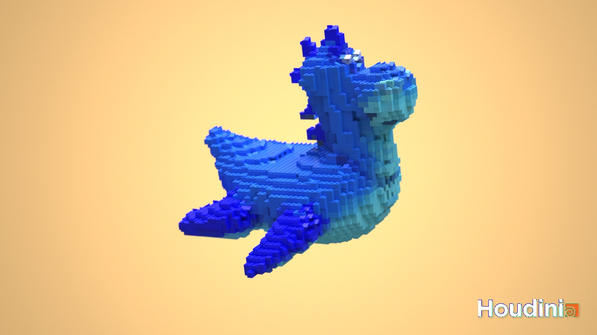
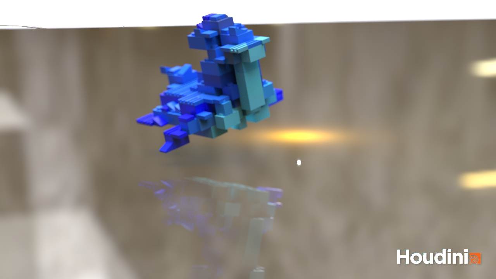
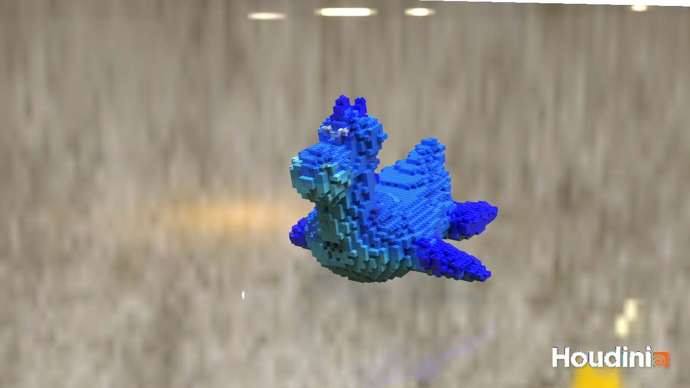
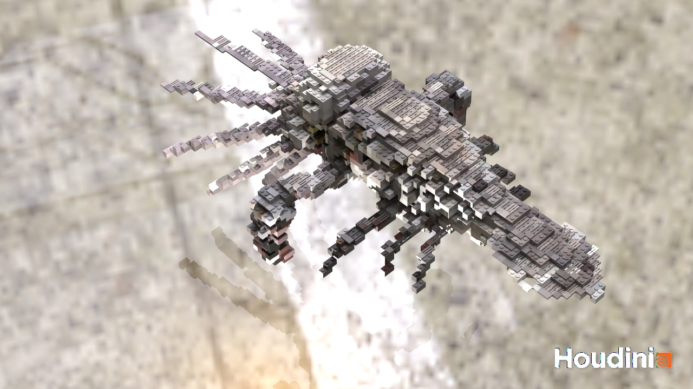
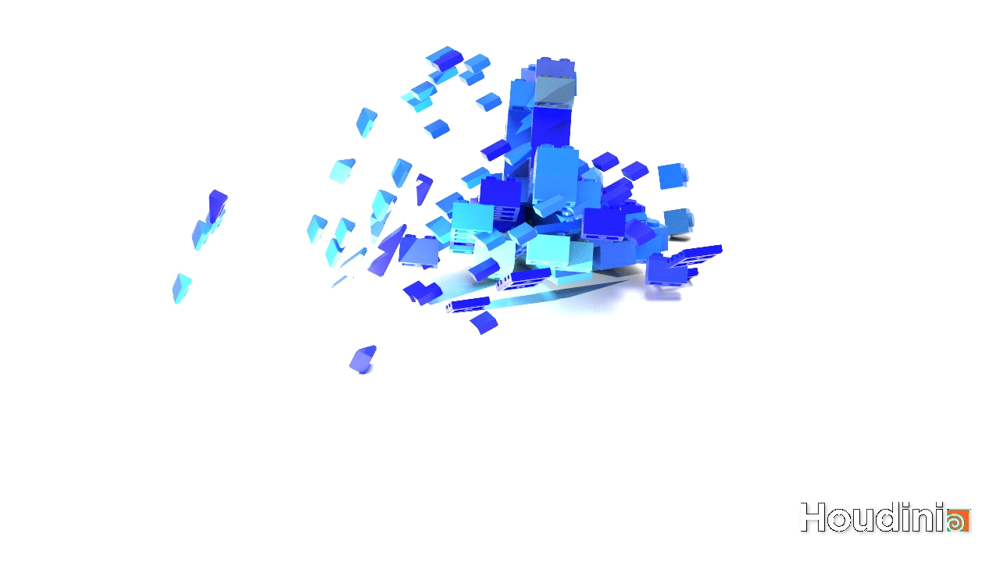
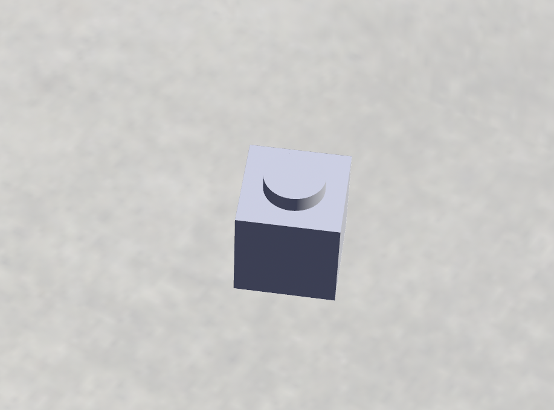
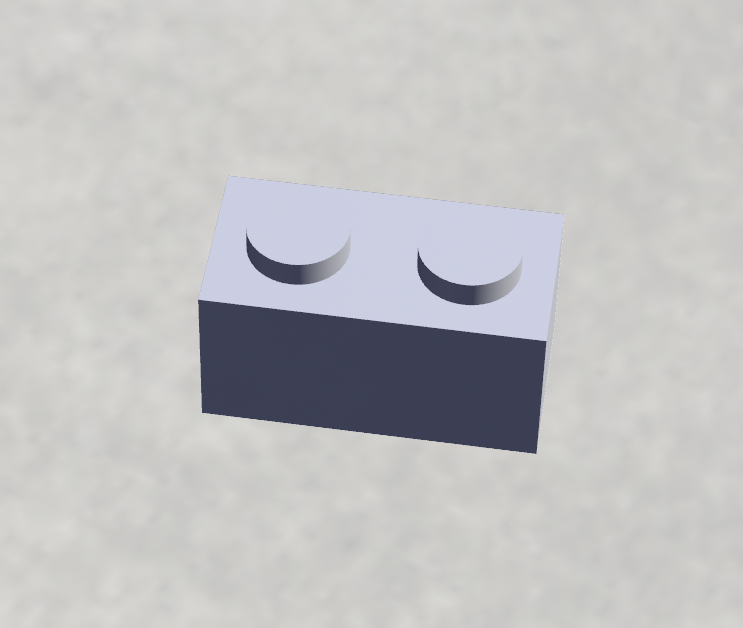
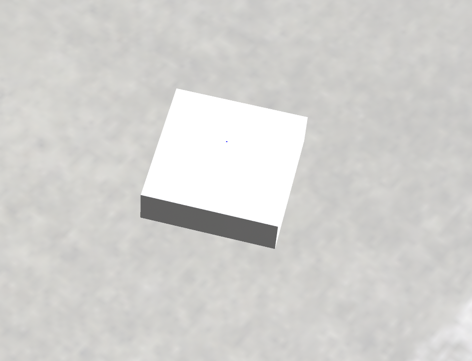

# LEGO-ifying Meshes

## Project Overview

### Ruijun(Daniel) Zhong
This is a Houdini project that can convert any faceted mesh to a collection of LEGO pieces.

---

||||
|:-:|:-:|:-:|
|Original Mesh|Less Lego piece|More Lego piece|

|||
|:-:|:-:|
|Original Mesh|Lego|

||
|:-:|
|Rigid body simulation|

## brick type:
|||||||
|:-:|:-:|:-:|:-:|:-:|:-:|
|1x1 block|2x1 block|2x2 block|1x1 flat brick|slope brick|2x1 flat brick|

## User Control:
||
|:-:|
* Size for each lego brick
* Brick numbers and seperation
* Slope brick percentage
* Flat brick percentage

## Implementation steps:
1. Initialize a test mesh, group its points, and transfer both normal and color attributes.
2. Utilize the attribute wrangle node to identify the highest point for flat bricks. Calculate the normal that significantly differs from the vector <0, 1, 0> to determine the sloped brick.
3. In a loop, group the remaining points: group sets of 4 for 2x2 bricks, sets of 2 for 2x1 bricks, and individual points for 1x1 bricks.
5. Merge all brick types.
6. Incorporate assemble and dop nodes to simulate a lego model drop, causing bricks to disperse upon impact.
7. Render using a three-point lighting setup.

