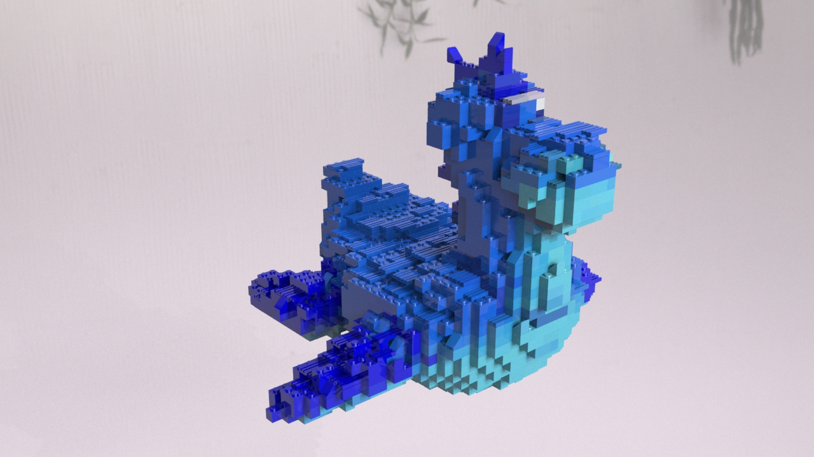

# LEGO-ifying Meshes

## Result

## Custom node

I design a subnetwork(legoize) which takes a mesh as input and outputs a legoized mesh. There are some parameters that can be adjusted to change the output:

* the scale of the bricks
* the threshold at which a particle is determined to be a sloped brick instead of a block brick.
* the percentage of "top" particles that display as flat bricks, rather than placing no brick there at all

## Converting the points to LEGO bricks

Three overall categories of LEGO bricks are supported in this project: block bricks, slope bricks, and flat bricks. Three different scale of Block bricks are supported: 1x1, 2x1, 2x2. 

| Block bricks        | Slope bricks         | Flat bricks|
| -----------         | -----------          |------              |
| |  | |

## Rendering

I created a simple principled shader for the bricks, whose roughness is set to 0 and metallic is set to 0 to make the bricks look like plastic. The color of the bricks is determined by the color of the input mesh.

## Extra Credit
- Rigid body simulation
  - Simulate dropping a LEGO model and having its bricks separate from the force of the impact. Here is the result:

  - Vertical glue constraints is added to mimic the brick studs locking together. Here is the result: