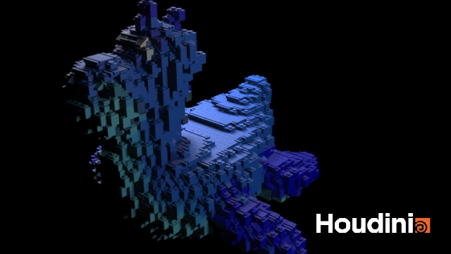
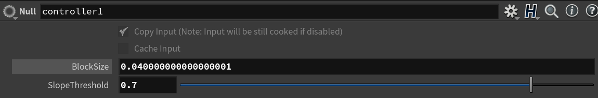
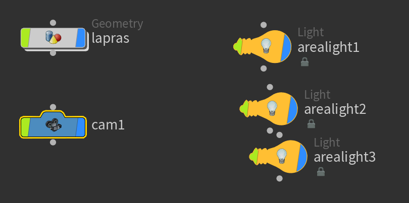

# LEGO-ifying Meshes

## Project Overview
Created custom nodes similar to the one in class. Included a plastic looking texture. 

Implemented block bricks, slope bricks and flat bricks. 

Used for loop and set bounding box. 

Added a controller for parameter.

Used three camera lighting set up and created a render image. 

