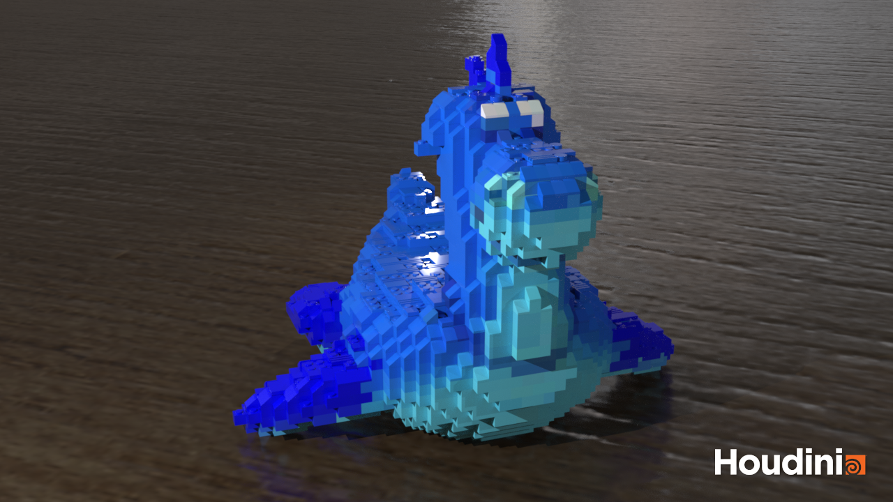
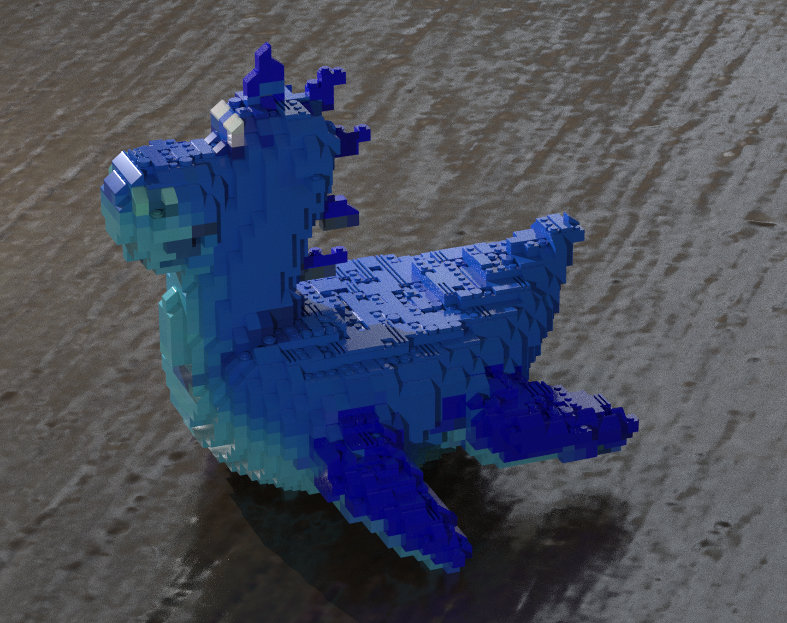

# LEGO-ifying Meshes

## Dineth Meegoda

Renders for Rubber Toy
==================

---

---

---

This project was a super cool application of Houdini that showed me the power of the tool and allows me the flexibility to play around with the output to get really interesting results. Although it was hard to look up how to do simple things, I eventually got it to work and I'm super proud of it!