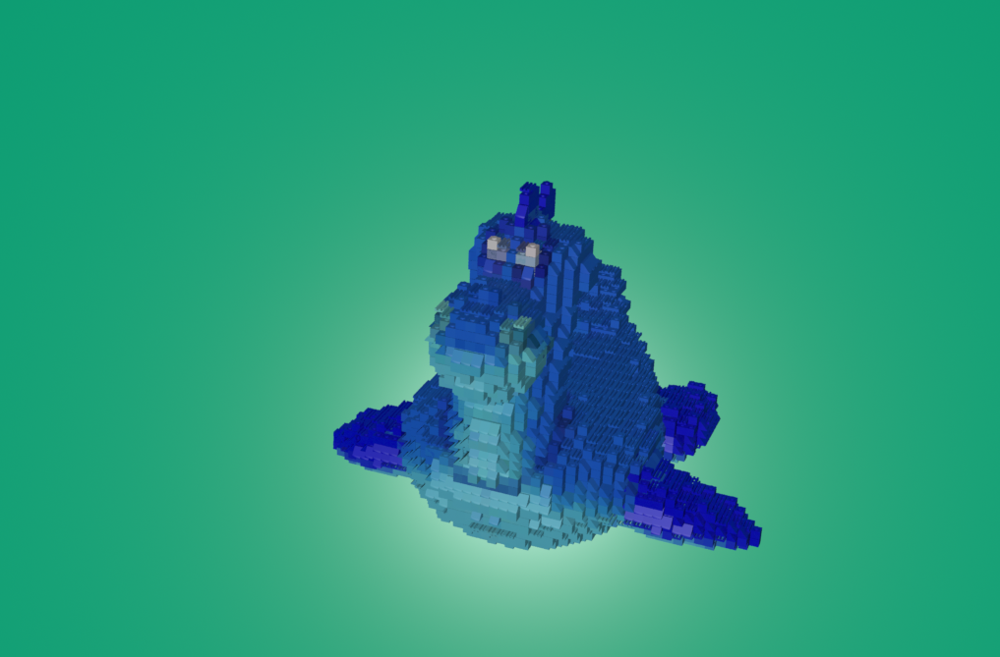
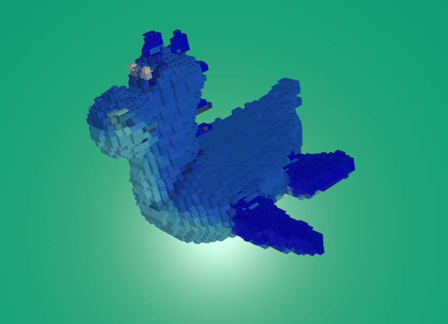
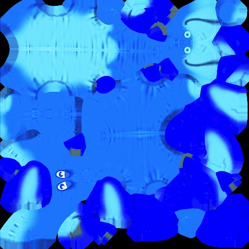
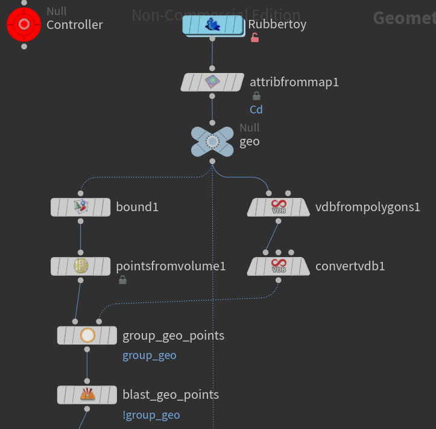
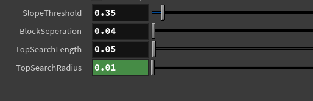

# LEGO-ifying Meshes

## Result





## Converting a mesh to points
To uniformly distribute points within a mesh, I encapsulated the mesh in a bounding box, created a point matrix, and converted it to a point cloud using the vdbfrompolygons node.

|Texture|Nodes|
| --- | --- |
|||


## Converting the points to LEGO bricks

|Block bricks|Slope bricks|Flat bricks|
| --- | --- | --- |
| |  | |

I used three nodes to define the type of each point:

* Flat:

**Bricks are placed on particles with no others above them:**


   ```
    vector dir = {0, 1, 0};
    float r = ch("radius");
    float len = ch("len");
    vector search_above_distance = @P + dir * len;
    vector search_below_distance = @P + dir * (-len);
    int points_above[] = pcfind(0, "P", search_above_distance, r, 1);
    int points_below[] = pcfind(0, "P", search_below_distance, len, 1);
    
    if (len(points_above) == 0 && len(points_below) == 1) 
    {
        @group_flat = 1;
    }
    
  ```
 * Slope
 
 **Slope bricks go on top particles with non-vertical surface normals:**

  ```
    float threshold = chf("threshold");
    if (abs(dot(@N, {0,1,0})) < threshold && @group_flat == 1) {
        @group_flat = 0;
        @group_slope = 1;
    }
  ```
 * General Block
 
  ```
    if(!@group_slope && !@group_flat){
    @group_block = 1;
}
  ```

## Preventing LEGO bricks from intersecting

#### Block Bricks Placement:

* Process all points in loops.
* For potential 2x2 brick placements:
    * If 4 points can be enclosed by the brick, place it.
    * Remove the other 3 points from consideration.

* For potential 2x1 brick placements:
    * If 2 points can be enclosed, place it and remove the second point.

* For any remaining points, only 1x1 bricks can be placed.

#### Slope Bricks Placement:

* Since slope bricks are 1x1, simply use copytopoints on all appropriate points.

#### Flat Bricks Placement:

* Loop through each point to determine placement.
* Try to place a 2x1 brick. If not feasible, place a 1x1 brick.
 
 
## Exposing node parameters

For the Controller:




The Lego brick placement is influenced by several parameters: The Slope Threshold dictates when to place slope bricks, while Block Separation sets the model's segmentation detail. Top Search Length establishes the distance for point searches, and Top Search Radius determines the spherical search boundary.
