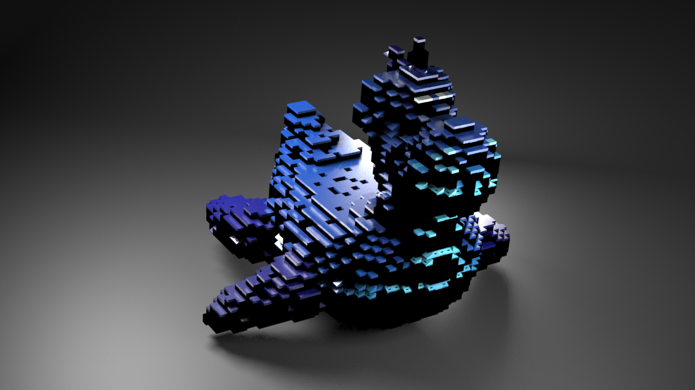
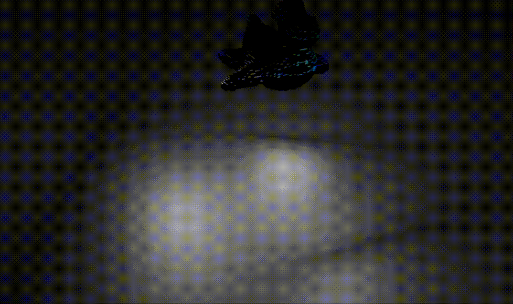
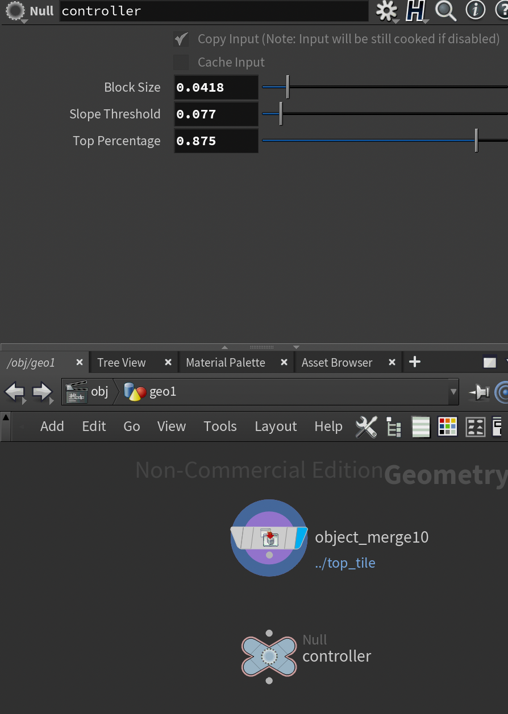
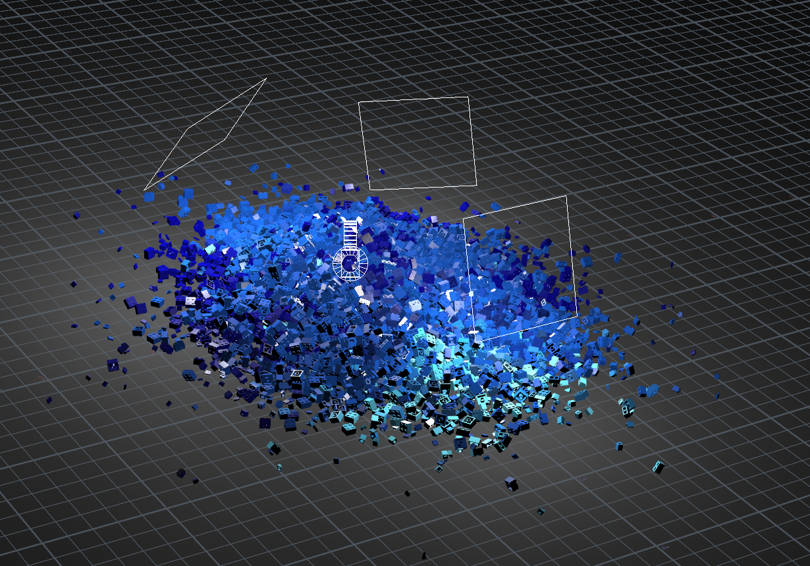
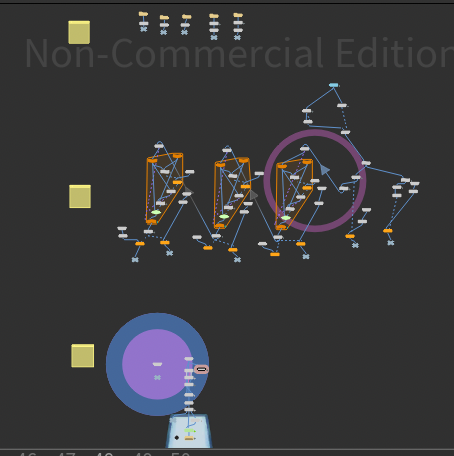

# LEGO-ifying Meshes

## Project Overview
In this assignment, you will make a Houdini project that can convert any faceted mesh to a collection of LEGO pieces.
You will continue your exploration of procedural modeling, while working with new Houdini nodes.

### Core Features: 

- lego pieces: 2x2,2x1,1x2,1x1,1x1-slope,1x1-top
- adjustable user interface (block size, top tile percentage, slope similarity threshold)
- rendering with three-point lighting technique 
- rigid body simulation

### Project Specification:

- user interface is at controller node:
    

- three-point lighting & rigid body simulation
    

- overall procedure:
    

