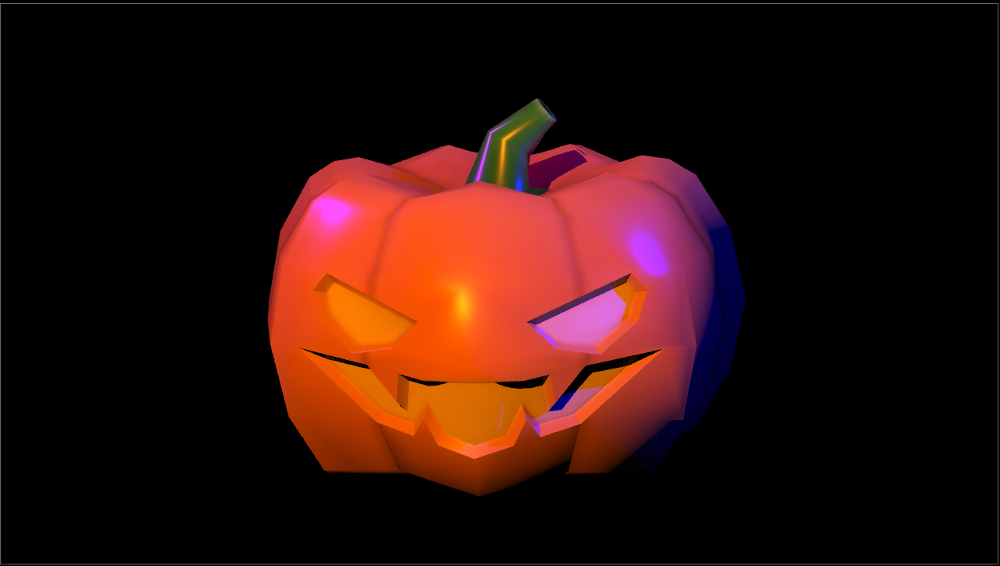
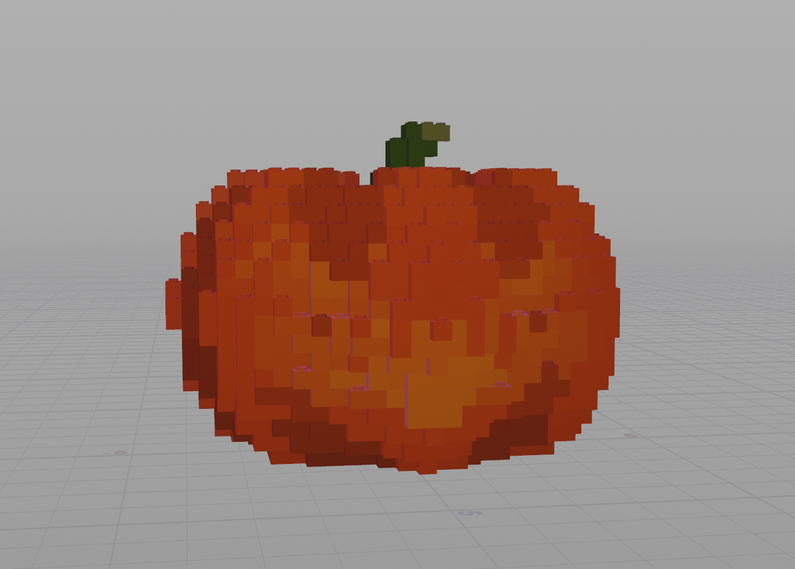

# LEGO-ifying Meshes in Houdini!

## Project Overview
In this project, I set out to convert any input faceted mesh to a collection of LEGO pieces, continuing my exploration of procedural modeling and Houdini's many nodes.

My overall goal was to create something that looks like this:

I decided to use a pumpkin mesh instead of the default toy mesh, and here is my final result!

---

## Step 1: Creating my custom LEGO-ifying node
I created a custom node in the network window to hold all of my work. The process begins with an input 3D model, and the output is a LEGOified version of that model, consisting of 3 different LEGO types: sloped, flat, and block bricks. This custom node sits at the top level of my scene, alongside the camera and various lights.

## Step 2: Set up some test geometry
Inside the custom LEGO-ifying node, it's time to load a fun model to work with! For this project, I used a 3D model of a pumpkin.

## Converting the mesh to points
- Used a VDB From Polygons node followed by a Convert VDB node to compute the closed volume of the mesh.
- In a separate node chain, computed the bounding box of the mesh and then used a Points from Volume node to generate points in 3D space.
  - The larger the particle separation, the larger the LEGO bricks will have to be in order to fill the space (and the mesh will be composed of fewer LEGO bricks).
- Combined the VDB volume and 3D points using a Group Create node to find all of the points that fall within the mesh's volume.
- Remove all of the points outside of that group with a Blast node.
- In an Attribute Wrangle node, set the scale of the particles (`@pscale`) proportional to the particle separation (`@particlesep`) defined in the Points from Volume node.
- Finally, used an Attribute Transfer node to obtain color and surface normal information for each particle based on the original mesh.

## Converting the points to LEGO bricks
For this project, I defined three overall categories of LEGO brick:
| Block bricks        | Slope bricks         | Flat bricks|
| -----------         | -----------          |------              |
| |  | |

In order to correctly place each type, I needed to categorize the points of the mesh.
- Slope bricks were placed at any particle whose transferred surface normal is sufficiently dissimilar to the vector <0, 1, 0>. I allow the user to specify the exact threshold of dissimiliarity.
- Flat bricks were only placed on particles that did not have another particle above them.
I used an Attribute Wrangle node to search the immediate area of each particle using VEX code.
- Block bricks (e.g. 2x2, 2x1, and 1x1 bricks) were placed anywhere else.

## Preventing LEGO bricks from intersecting
I made sure that the bricks do not intersecting other bricks. To do so, I perform a bounding box test for each brick:
- Using a pair of Block Begin and Block End nodes, iterated over every particle in the mesh volume
  - To examine each particle individually, compared its `@ptnum` to the iteration number (`detail(1, "iteration")`).
- For the particle currently being examined, used a Copy to Points node to place a Box at its location,
where the Box's size is the size of the LEGO brick being placed. This acts as the potential brick's bounding box.
- Using a Group Create node with the bounding box and particle field as inputs,
assigned the particles that fall within the bounding box to a group.
  - This node was fed into a Wrangle Attribute node that uses VEX to remove all particles
(except the current loop iteration particle) that fall within the bounding box
from the particle field, effectively tagging them as "used up" in the placement of the brick
  - If the number of particles within the bounding box equals the number of particles it
would overlap if it were the first brick placed (e.g. 4 particles for a 2x2 block brick),
then the current particle is a valid location at which to place a brick.
  - If the number of particles within the bounding box is less than the number it would normally overlap,
then a brick __should not__ be placed there (i.e. the loop just continues to the next particle)
- The two "if" statement branches in the above bullet points were implemented using a Switch-If node,
 which were followed by a Split node to create two "outputs" from this logic: particles in a group tagging them as
"places to put a brick on" and "places that did not have a brick placed at them".

## Exposing node parameters
Allowed the user to interact with the node as a singular tool by exposing certain parameters:
- Adjusting the scale of the bricks that compose the model, allowing it to be made from more or fewer bricks.
  - This adjusts the spacing of the mesh particles as well as the scale of the LEGO brick FBXs
- Changing the threshold at which a particle is determined to be a sloped brick instead of a block brick.
- Adjusting the percentage of "top" particles that display as flat bricks, rather than placing no brick there at all.