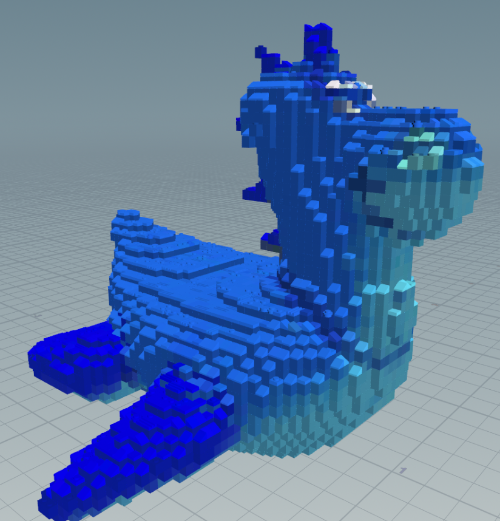
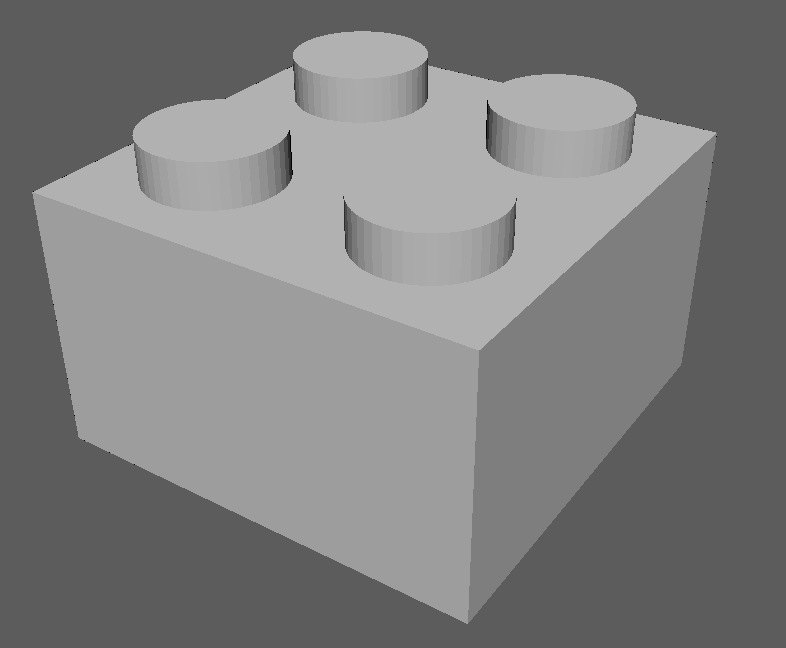
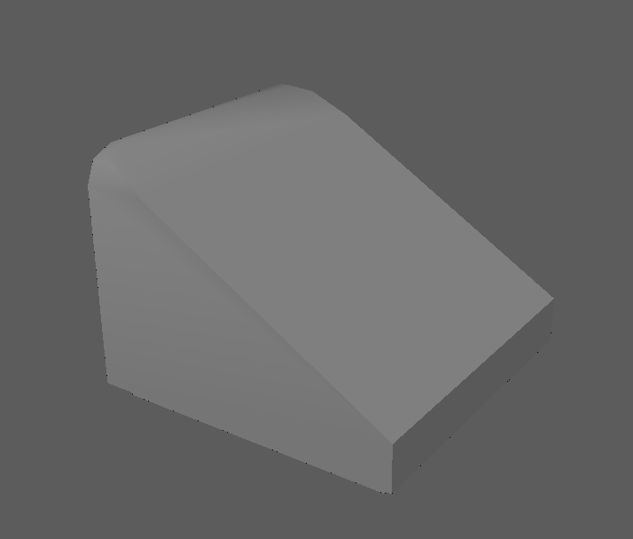

# LEGO-ifying Meshes

## Submission | Aboudi Rai

## Project Overview
In this assignment, you will make a Houdini project that can convert any faceted mesh to a collection of LEGO pieces.
You will continue your exploration of procedural modeling, while working with new Houdini nodes.

Aditya has prepared [this video](https://drive.google.com/file/d/1G9gQGdfXqjnIJN506FEyxsK1wS7M55hL/view) to help explain
some of the Houdini nodes you will use in this project.


---

## Creating your node
Create a custom node in the nodes window that you will enter and add nodes within; this will be your LEGO-ifying node.

## Set up some test geometry
Use one of Houdini's Test Geometry nodes to start yourself off with a faceted mesh.
Now you have something with which to visualize the results of your nodes as you progress in your implementation.

## Converting a mesh to points
- Use a VDB From Polygons node followed by a Convert VDB node to compute the closed volume of your mesh.
- In a separate node chain, compute the bounding box of your mesh and then use a Points from Volume node to generate points in 3D space.
  - The larger the particle separation, the larger your LEGO bricks will have to be in order to fill the space (and your mesh will be composed of fewer LEGO bricks).
- Combine your VDB volume and 3D points using a Group Create node to find all of the points that fall within your mesh's volume.
- Remove all of the points outside of that group with a Blast node.
- In an Attribute Wrangle node, set the scale of your particles (`@pscale`) proportional to the particle separation (`@particlesep`) you defined in your Points from Volume node.
- Finally, use an Attribute Transfer node to obtain color and surface normal information for each particle based on the original mesh.

## Converting the points to LEGO bricks
For this assignment, we require you to support three overall categories of LEGO brick:
| Block bricks        | Slope bricks         | Flat bricks|
| -----------         | -----------          |------              |
| |  | |

In order to correctly place each type, you will need to categorize your mesh points.
- Slope bricks should be placed at any particle whose transferred surface normal is sufficiently dissimilar to the vector <0, 1, 0>.
You will ultimately allow the user to specify the exact threshold of dissimiliarity, so you may set it to whatever value you wish for now.
- Flat bricks should only be placed on particles that do not have another particle above them.
You can use an Attribute Wrangle node to search the immediate area of each particle using VEX code.
For example, you could find the number of points above each point using `pcfind`: `int ptsAbove[] = pcfind(0, "P", location_to_search, search_radius, 1);`
If `location_to_search` is `@P` plus some vertical offset, you can effectively search only the area above each particle.
- Block bricks (e.g. 2x2, 2x1, and 1x1 bricks) can be placed anywhere else.

Consider assigning particles to different groups based on the criteria above, then placing bricks based on each particle's group.
For example, you could set a particle to be in a "top of mesh" group like so using VEX:
```
if (len(ptsAbove) == 0 && len(ptsBelow) == 1) {
    @group_top = 1;
}
```

## Preventing LEGO bricks from intersecting
Since we ask you to create your LEGO-ified model from bricks that are not simply 1x1 in size, you will need to make sure that
the bricks you place are not intersecting other bricks. To do so, you will need to perform a bounding box test for each brick:
- Using a pair of Block Begin and Block End nodes, iterate over every particle in your mesh volume
  - To examine each particle individually, you can compare its `@ptnum` to the iteration number (`detail(1, "iteration")`).
- For the particle you're examining, use a Copy to Points node to place a Box at its location,
where the Box's size is the size of the LEGO brick you're trying to place. Thsi will act as your potential brick's bounding box.
- Using a Group Create node with your bounding box and particle field as inputs,
assign the particles that fall within the bounding box to a group (its name is up to you).
  - This node should feed into a Wrangle Attribute node that uses VEX to remove all particles
(except the current loop iteration particle) that fall within the bounding box
from the particle field, effectively tagging them as "used up" in the placement of the brick
  - If the number of particles within your bounding box equal the number of particles it
would overlap if it were the first brick placed (e.g. 4 particles for a 2x2 block brick),
then the current particle is a valid location at which to place a brick.
  - If the number of particles within your bounding box is less than the number it would normally overlap,
then a brick __should not__ be placed there (i.e. the loop should just continue to the next particle)
- The two "if" statement branches in the above bullet points can be implemented using a Switch-If node,
 which can be followed by a Split node to create two "outputs" from this logic: particles in a group tagging them as
"places to put a brick on" and "places that did not have a brick placed at them".

## Exposing node parameters
Allow a user to interact with your node as a singular tool by exposing certain parameters:
- Adjusting the scale of the bricks that compose your model, allowing it to be made from more or fewer bricks.
  - This should adjust the spacing of your particles as well as the scale of the LEGO brick FBXs
- Changing the threshold at which a particle is determined to be a sloped brick instead of a block brick.
- Adjusting the percentage of "top" particles that display as flat bricks, rather than placing no brick there at all.

## Rendering
Render at least one LEGO-ified mesh using the three-point lighting technique discussed in class, and apply a plastic-like material to your bricks.

## Extra Credit
- Rigid body simulation
  - Simulate dropping your LEGO model and having its bricks separate from the force of the impact
  - For even more credit, try adding vertical glue constraints to mimic the brick studs locking together
- Add more brick types
  - Use irregularly-shaped bricks such as a leaf to create terrain
  - Refer to [stud.io](https://www.bricklink.com/v3/studio/download.page) for additional brick models
