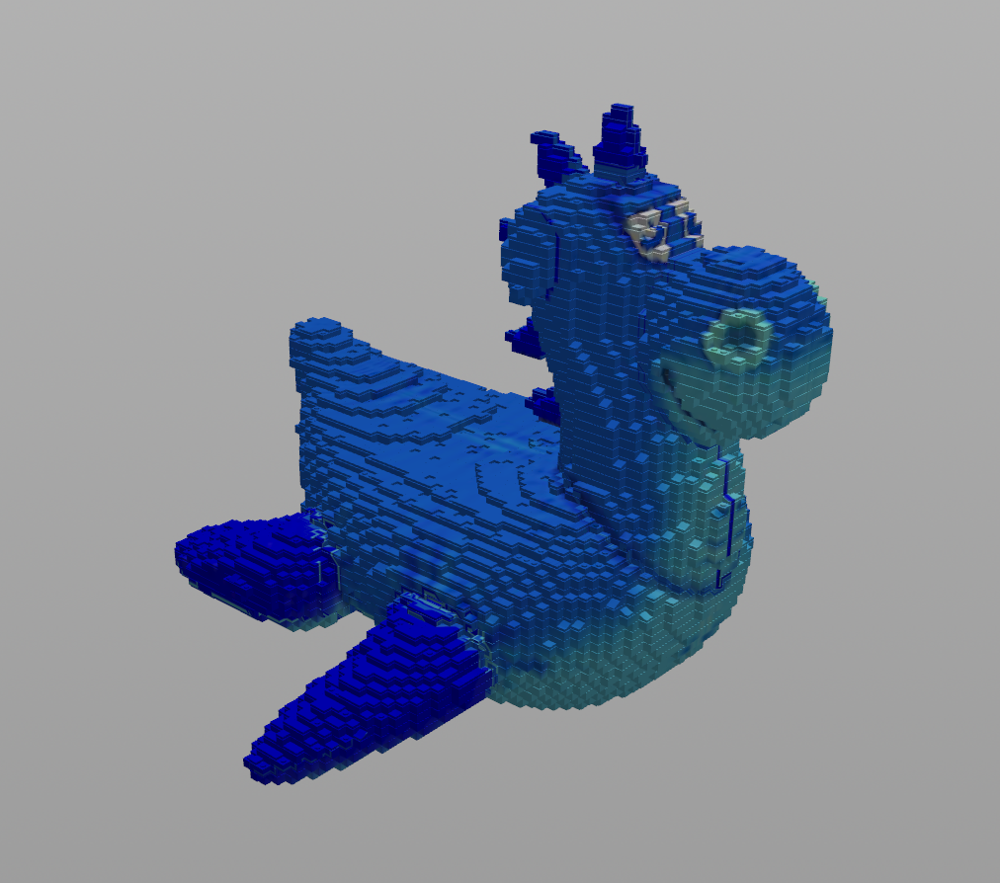

# LEGO-ifying Meshes - Mesh

## Product:

## Objective:
To make a Houdini project that can convert any faceted mesh to a collection of LEGO pieces.

## Converting mesh to points:
This was done using the procedure given in lecture. Essentially, I used VDB data to compute the volume of the mesh and then used a Points from Volume node to generate the points in 3D space from the mesh. The particle separation is an attribute that the user has control over. 

## Setting brick types:

### Flat Bricks:
I first decided which points would qualify for having flat bricks placed at their position. I did this using Houdini's pcfind() function, determining whether there were points above and below the point. If there weren't points above but were points below, I added them to the "flat" point group. Later, after they had been separated from the other types of bricks, I used the 'Keep by random chance' attribute in the 'Group' node to set how many flat bricks remained, leaving the exact percentage up to the user.

### Slope Bricks:
My next category was slope bricks. Slope bricks also have to be at the top of the mesh, so they are a subcategory of the flat bricks. I determined whether a point was fit for a slope brick based off of its normal vector dotted with the <0, 1, 0> vector. The threshold that differs sloped bricks from block bricks is decided by the user.

### Block Bricks:
To decide the identity of the rest of the bricks, I used a greedy-like algorithm, where we attempted to place the largest available type of block at the given point. If any undesired intersections occurred, we would leave the space empty until the program attempts to place the next largest type of block in that space. In total, the program considers 2x1x2, 2x1x1, and 1x1x1 blocks.