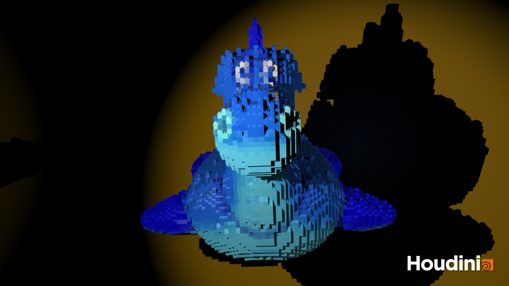
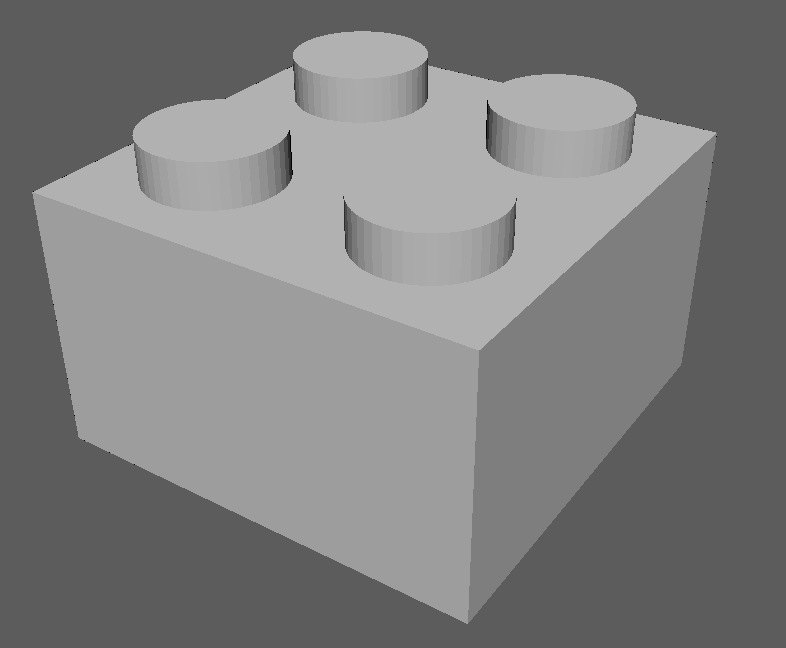
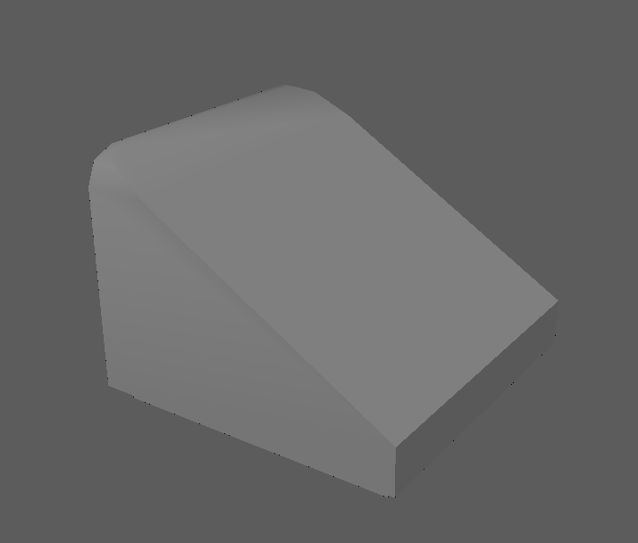
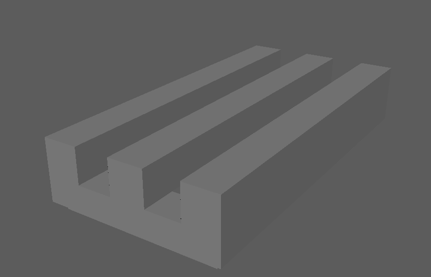

# LEGO-ifying Meshes

## Result

https://github.com/horo-ursa/hw03-legos/assets/54868517/9d3fc084-b38a-4395-8e5d-760e35ca9f33



## Mesh Pre-Processing
- The objective is to generate a set of points that are consistently distributed within the mesh itself.
- To accomplish this, I began by encasing the mesh within a bounding box and subsequently forming a matrix of points within this box. Utilizing the `vdbfrompolygons` node, I transformed the mesh into a point cloud, in which every point inside serves as a potential location for a LEGO brick.
- color and normal attributes for every point in our cloud are determined using the `attributefrommap` and `attributetransfer` nodes, which extract and assign the color and normal attributes based on the original mesh.


## Converting the points to LEGO bricks

| Block bricks        | Slope bricks         | Flat bricks|
| -----------         | -----------          |------              |
| |  | |

There are mainly three types of lego bricks that I use in this project.
- Flat bricks should only be placed on particles that do not have another particle above them.
  - To find those points, I use `pcfind` to find if there are points above and below one point
  - ```
    if (len(ptsAbove) == 0 && len(ptsBelow) == 1) {
        @group_top = 1;
    }
  ```
- slope bricks should be placed at the `group_top` particles whose transferred surface normal is sufficiently dissimilar to the vector <0, 1, 0>
- Block bricks then should be placed at the remaining points

## Preventing LEGO bricks from intersecting

In order to prevent Lego bricks from intersecting with themselves, I used loops to process all points
- For points that should put block bricks, I try to put a 2x2 brick at each point
  - If the brick encloses 4 points, then I know it can be successfully placed at this point
    - then the other 3 points should be removed from the loop
  - After the previous loop, I try to put a 2x1 brick at each point
    - we do the same process as before
  - Now we know that for the remaining points, we can only place a 1x1 brick
- Slope bricks are much easier, since it is only a 1x1 block we can simply use `copytopoints` to all points that should place slope bricks
- For flat bricks, we do the same process as block bricks, loop through all of them, and see if we can place a 2x1 brick at each point
  - otherwise, place a 1x1 block brick
 
## Exposing node parameters

In order to allow a user to interact with my node as a singular tool, I exposed certain parameters to a null node as a controller
- Top Group Search Length: the length of destination to search for points
- Top Group Search Radius: the radius of the sphere cast to search for points
- Slope Threshold: the threshold to cast a point to place slope bricks
- Separation: how detailed we want to separate our model
