# LEGO-ifying Meshes
- Name: Tongwei Dai
- This readme provides a brief overview of the techniques and algorithms I used to make a mesh Lego-ifier in Houdini.

## Result and Demo

### Collision Demo
https://github.com/dw218192/hw03-legos/assets/31294154/8d31ccf7-6d2c-4aeb-b677-4cd11b2ae788

### Blue Toy Model

### LEGO-ified Blue Toy (low resolution)
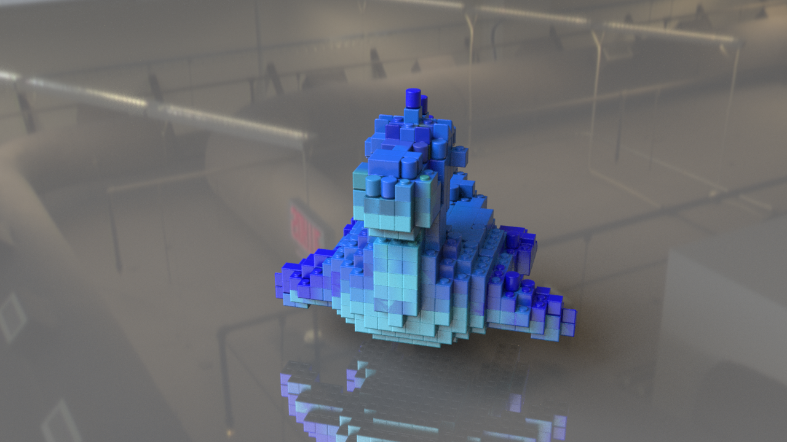

### LEGO-ified Blue Toy (mid resolution)
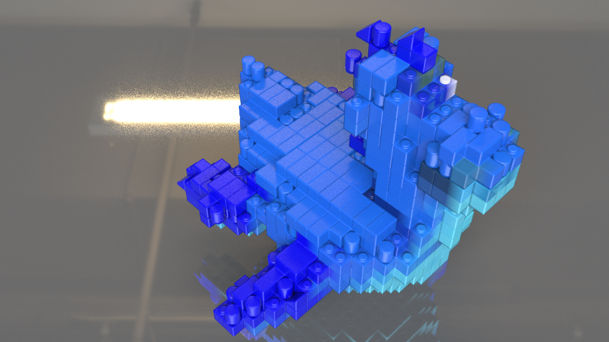

### LEGO-ified Blue Toy (high resolution)
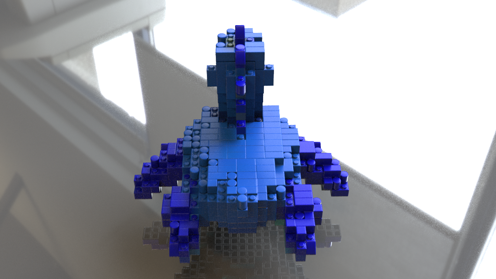

### Human Model
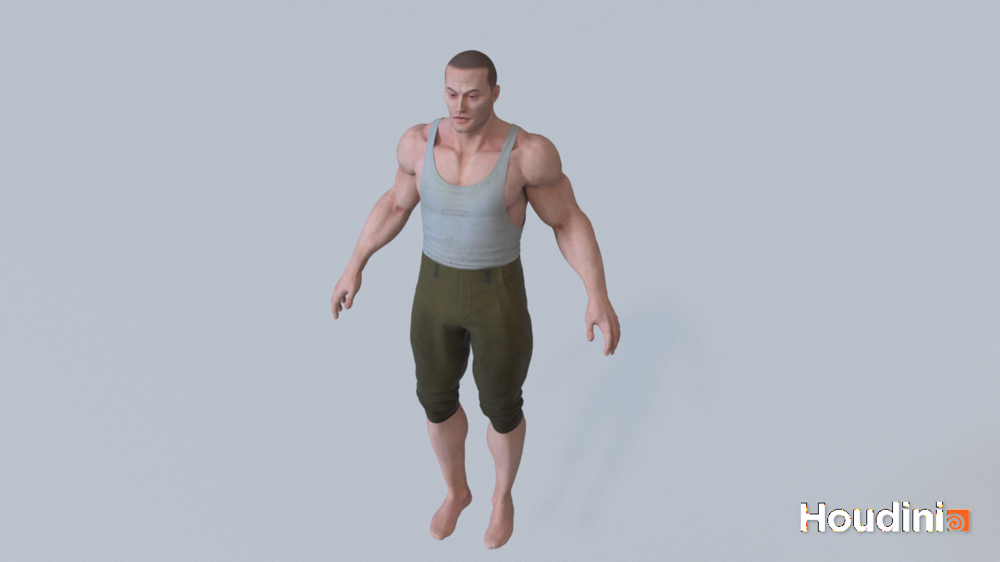
- note that I did not map the color of the clothes to the LEGO pieces

### LEGO-ified Human (low resolution)
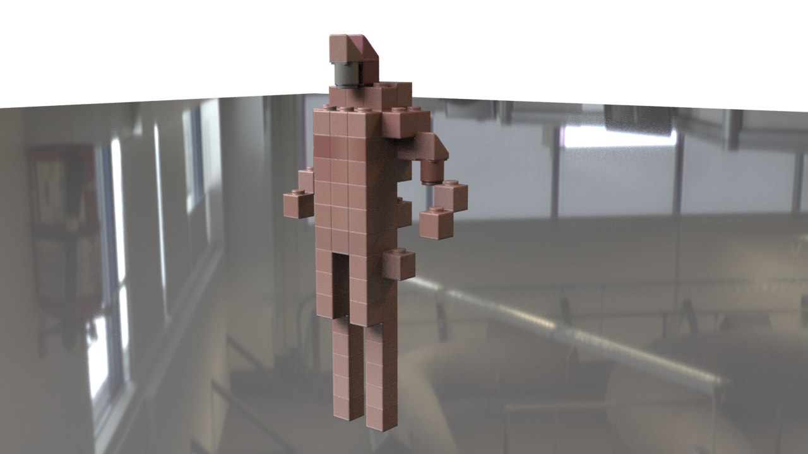

### LEGO-ified Human (mid resolution)
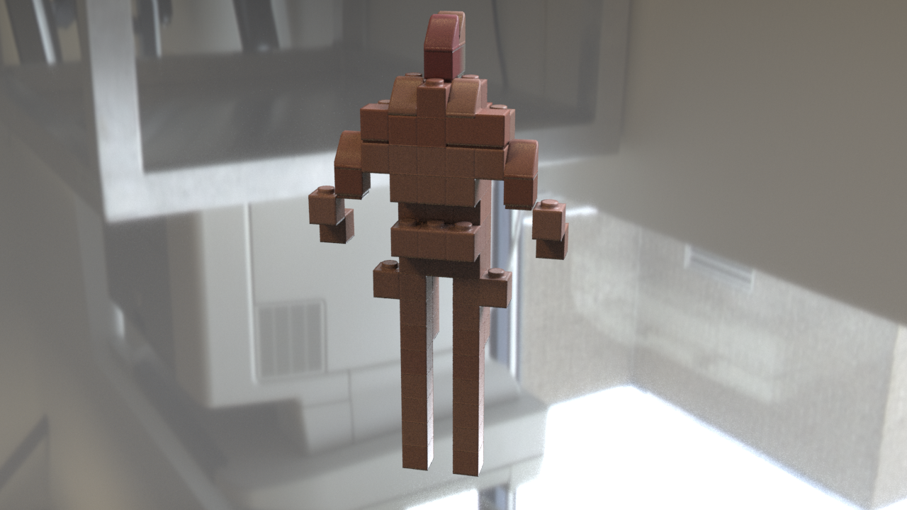

### LEGO-ified Human (high resolution)
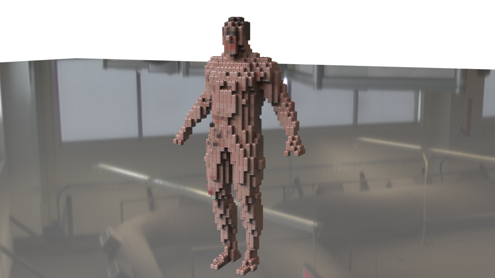

## Preprocessing the mesh
- The goal is that we want a group of uniformly distributed points that are either on the surface of the mesh or inside the mesh.
- To achieve this, I started by creating a bounding box around the mesh and then creating a grid of points inside the bounding box.
- Then, I used the `vdbfrompolygons` node to create a signed distance field from the mesh. This allows me to determine whether a point is inside or outside the mesh.
- Each point in the resulting point cloud is a candidate for a LEGO brick placement.
- Note: color and normal attributes are also computed for each point in the point cloud by using the `attributefrommap` and `attributetransfer` nodes that fetch and map the color and normal attributes from the original mesh.

## Preventing LEGO bricks from intersecting
- I used the brute-force approach to prevent LEGO pieces of different sizes from intersecting with each other
- Below is a high-level overview of the algorithm:
    - While there are unplaced points in the point cloud, 
    - For each point in the unplaced points,
        - Try to place a LEGO piece at the point
        - If the bounding box of the LEGO piece do not cover the same number of points as the LEGO piece's connector points,
            - Try to place a LEGO piece at the next point
        - Else,
            - Place the LEGO piece at the point
            - Remove all the points covered by the LEGO piece from the point cloud
- The algorithm is implemented as a custom subnet to make it easier to reuse the algorithm for different LEGO pieces.

## LEGO piece precendence
- However, we must be careful about how we iterate through the LEGO pieces
- Each LEGO piece has different constraints in addition to the number of points it covers. We can roughly divide them into 3 categories:
    - LEGO pieces that can be placed anywhere (bricks)
    - LEGO pieces that can only be placed on the top of other LEGO pieces (caps)
    - LEGO pieces that can only be placed on the side of other LEGO pieces, and on where the original mesh has a slope (slopes)
- If we place a LEGO piece with few constraints first, we may not be able to place a LEGO piece with more constraints because all the points that satisfy the constraints have already been covered by the LEGO piece with fewer constraints.
- Therefore, some sort of precedence must be established to ensure that LEGO pieces with more constraints are placed first.
- Obviously, slope pieces have the most constraints, followed by cap pieces, and then bricks.
- Within each category, we can further establish precedence by sorting the LEGO pieces by the number of points they cover.
- The following table shows the precedence of all the LEGO pieces I used in this project:

| LEGO Part Type | Image |
|-|-|
| Slope 1x1 | 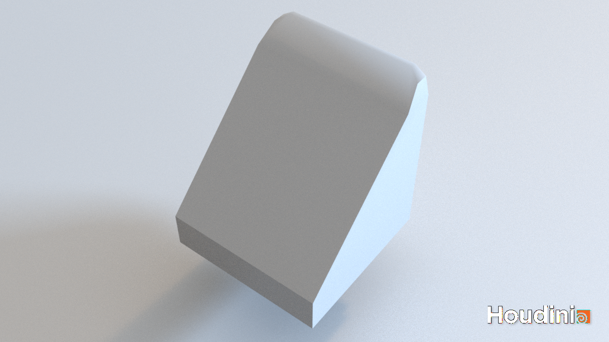 |
| Cap 2x1 | 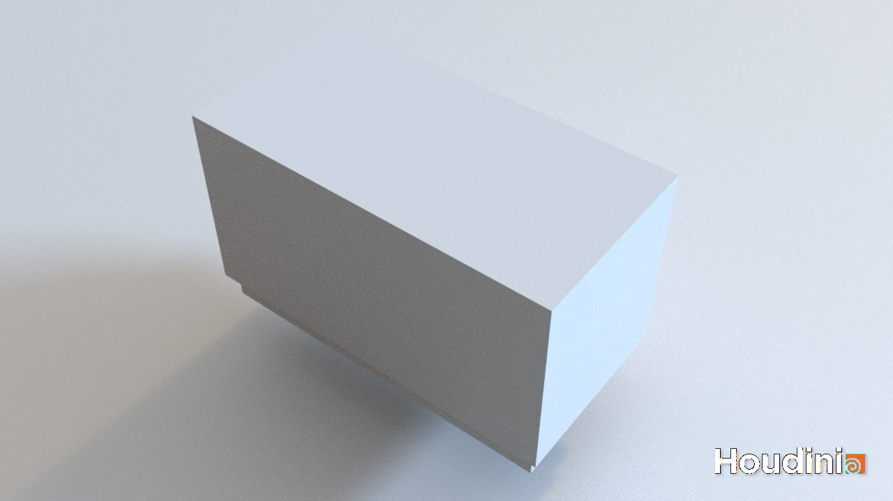 |
| Cap 1x1 (round/square) | 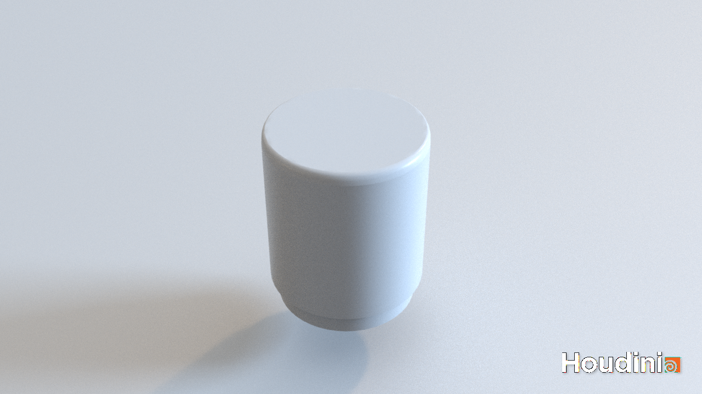 |
| Brick 2x2 | 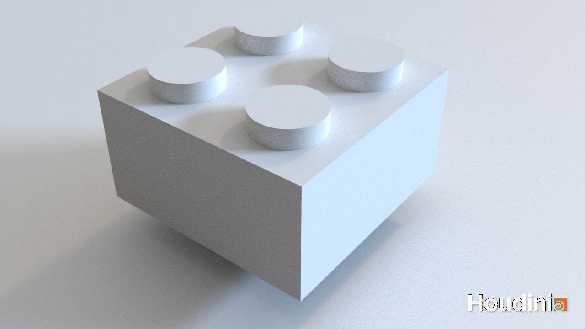 |
| Brick 2x1 | 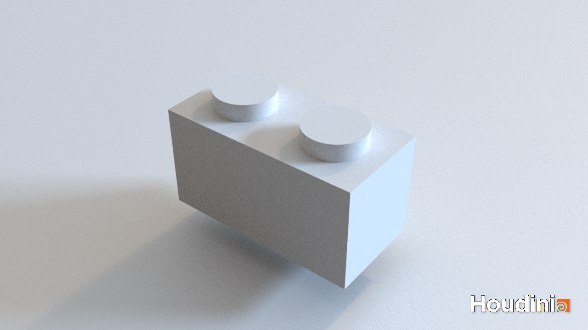 |
| Brick 1x1 | 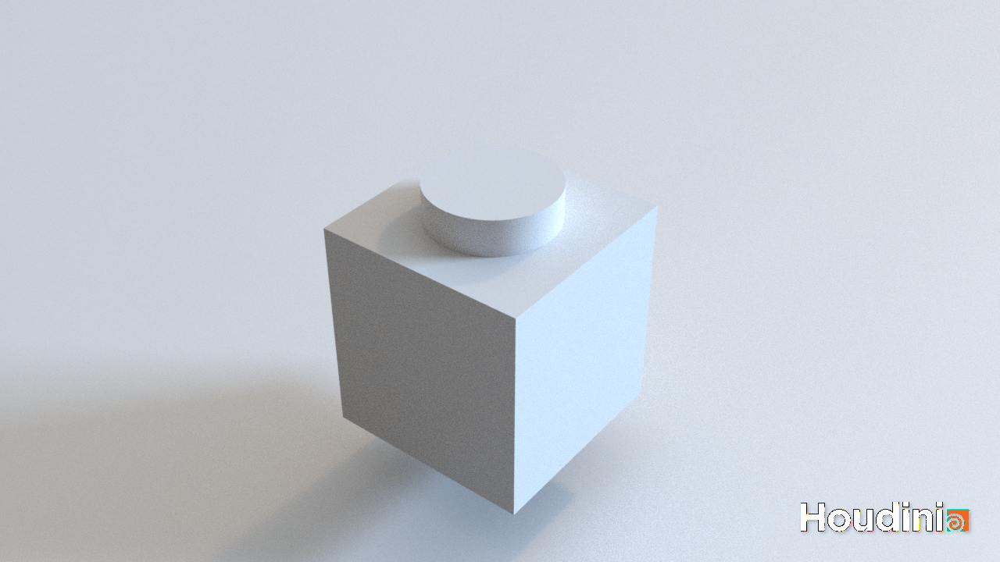 |

## Exposing node parameters
- There are a lot of parameters that can be tweaked to change the look of the LEGO-ified mesh
- Below is a list of parameters that I exposed:

| Parameter Name | Description |
|-|-|
| `blocksize` | The size of the LEGO piece |
| `slope_thres` | The threshold for the slope angle above which a point is considered to be on a slope |
| `check_radius` | The radius of the sphere casted to check for intersections |
| `height_tweak` | The amount of height scaling applied to the LEGO pieces to avoid gaps between LEGO pieces |
| `normal_transfer_thres` | Used in `attributetransfer` node's transfer function; this affects the normals mapped to the point cloud |
| `transfer_sample_cnt` | Used in `attributetransfer` node's transfer function; this affects the normals mapped to the point cloud |
| `check_dist_factor` | The distance factor used for the sphere casted to check for intersections |
| `target_normal` | The vector that represents the "up" direction, against which the slope angle is computed |
| `texture` | The texture used to color the LEGO pieces |
