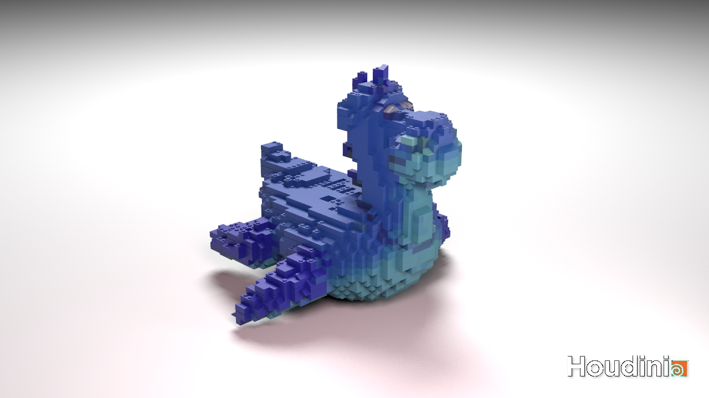
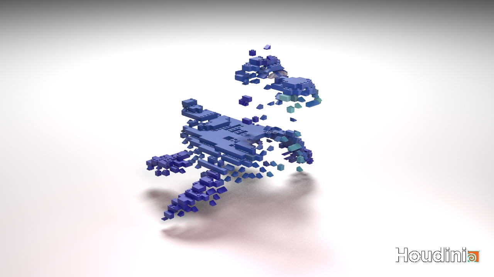
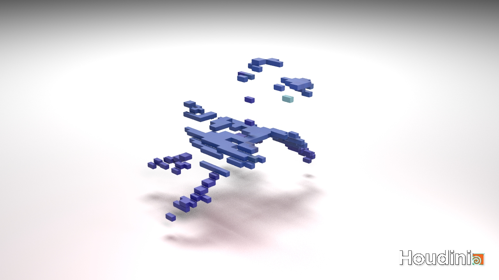
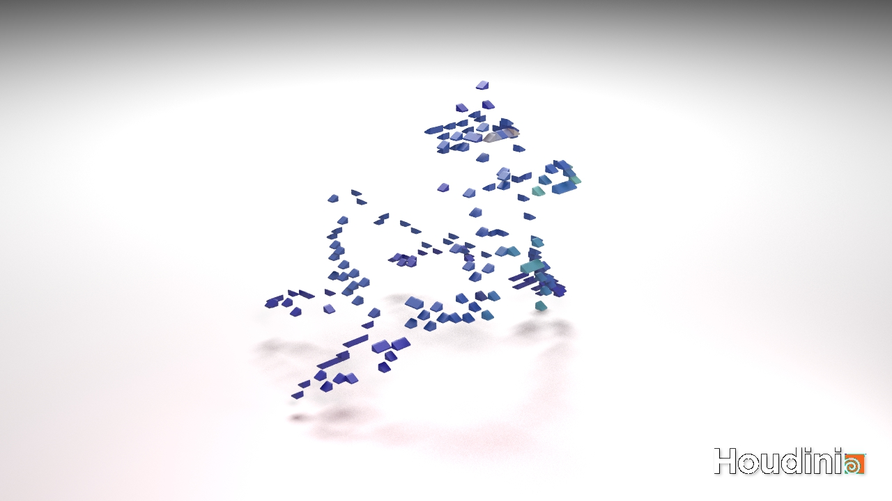
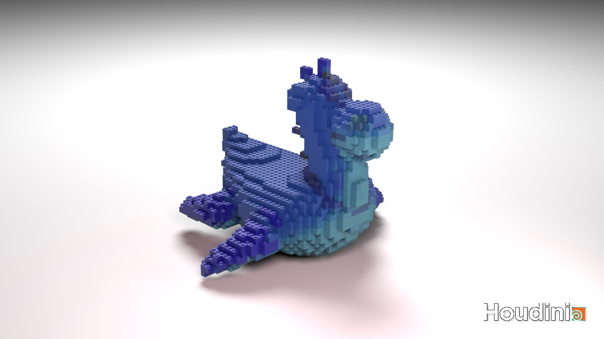
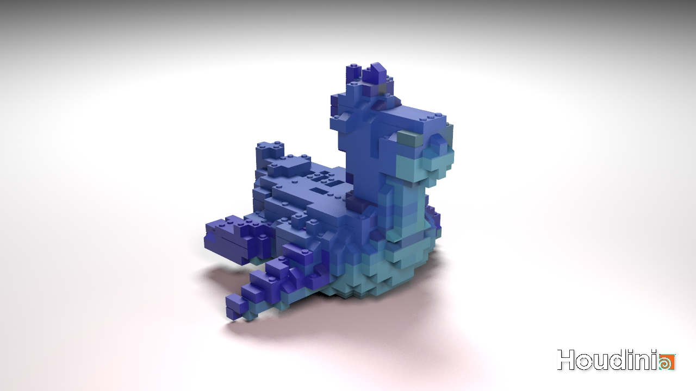

# LEGO-ifying Meshes

- Chang Liu
- Houdini Lego-lizer

### Result

### Features

- Supporting 4 types of bricks: 2x2, 2x1, 1x1, slope (all 4 directions)
- Exposed control parameters
  - Block scale
  - Slope brick threshold
  - Top brick flat rate
- Photorealistic rendering with three-point lighting

#### Converting points to bricks

In this step, I didn't want to use `pcfind`, so I came up with another solution to extract top bricks. I created two identical VDB fields from input polygon mesh, and transformed one of them down along y axis for a small distance `@pscale`. Then, I used boolean operations to subtract two fields to get points on the top, and then convert them to bricks:

To convert top points to bricks, I first tried to place 2x1 bricks through a loop. A flat brick threshold is used to control the number of flat bricks. If one position is not selected to place flat brick, it is left two the next pass. After all 2x1 pieces are placed, the rest of bricks are decided whether to be slope bricks or 1x1 bricks.

For slope bricks, I group them depending on their normal direction.

For body, I also used boolean operation to intersect two VDB fields. The rest of work is similar to placing bricks on the top. First 2x2 bricks are placed, then 1x1.

#### Parameter Control

This shows generated meshes with different brick scale.

|  |  |
| ----------------- | --------------- |

In addition to brick scale, I added two parameters to control brick generation: slope brick threshold and top brick flat rate.
