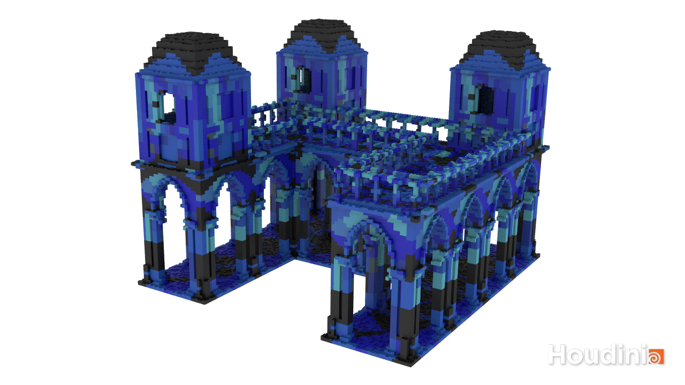
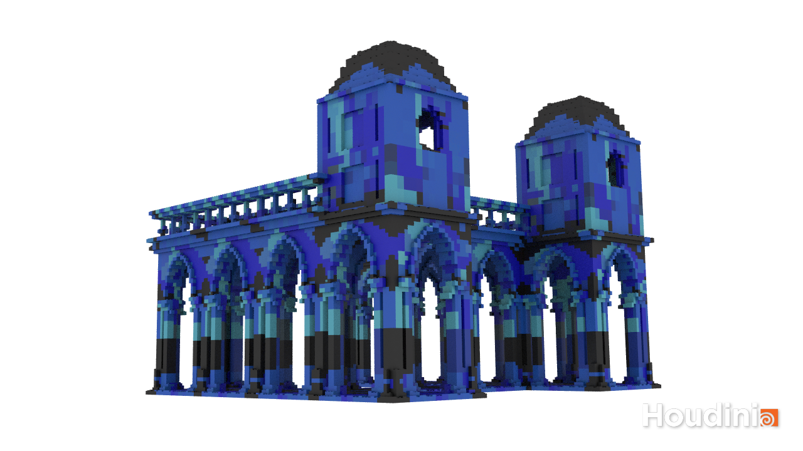
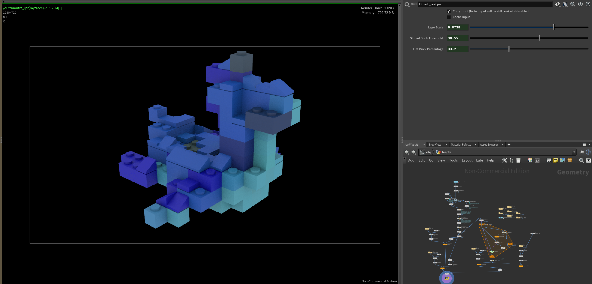

# LEGO-ifying Meshes

## Project Overview
Procedural Houdini + VEX project that converts any faceted mesh to a collection of LEGO pieces.

 

## Legofy Node
Create a custom node Legofy, containing the input mesh and lego-fying algorithm. 

## Converting a mesh to points
- Used a VDB From Polygons node followed by a Convert VDB node to compute the closed volume of the mesh.
- In a separate node chain, computed the bounding box of mesh and then used a Points from Volume node to generate points in 3D space.
- Combined VDB volume and 3D points using a Group Create node to find all of the points that fall within your mesh's volume.
- Removed all of the points outside of that group with a Blast node.
- In an Attribute Wrangle node, set the scale of particles (`@pscale`) proportional to the particle separation (`@particlesep`) defined in your Points from Volume node.
- Finally, used an Attribute Transfer node to obtain color and surface normal information for each particle based on the original mesh.

## Converting the points to LEGO bricks
This implementation supports three overall categories of LEGO brick: block bricks, slope bricks, and flat bricks. 

Mesh points are categorized to place each block type correctly.
- Slope bricks are be placed at any particle whose transferred surface normal is sufficiently dissimilar to the vector <0, 1, 0>. The user can adjust this threshold. 
- Flat bricks are only be placed on particles that do not have another particle above them.
- Block bricks (2x2 and 1x1 bricks) are placed for all other points.

## Slope and Flat Bricks
- I first used VEX to find top bricks, that is bricks with no other bricks above them, using the method outlined above. I created an attribute to remember if each point is a top brick.
- I then moved to sloped bricks, in which I compare an angle threshold, chosen by the user, to the angle between the point's normal and <0,1,0>. If the angle fell within the desired bounds, that point received an attribute telling me that it was a sloped bricks.
  - The normals for each point were passed using an Attribute Transfer node from the original input geometry. 
  - Sloped bricks must also be top bricks.
  - I oriented sloped bricks by setting their @N.y to 0, and their @N.x or @N.y to 1.0, depending on which was originally larger. This places the slope in the direction that makes it the closest representation to the curves of the original mesh.
  - I then copied the corresponding bricks to the points based on their attributes. 

## Preventing LEGO bricks from intersecting
Since the implementation uses differing-sized bricks, we make sure that
the bricks placed are not intersecting other bricks by performing a bounding box test for each brick:

- Using a pair of Block Begin and Block End nodes, iterate over every particle in mesh volume
- For the particle in question, I used a Copy to Points node to place a Box at its location,
where the Box's size is the size of the LEGO brick it's trying to place. Thsi will act as the potential brick's bounding box.
- Using a Group Create node with the bounding box and particle field as inputs,
assign the particles that fall within the bounding box to a group.
  - This node feeds into a Wrangle Attribute node that uses VEX to remove all particles
(except the current loop iteration particle) that fall within the bounding box
from the particle field, effectively tagging them as "used up" in the placement of the brick
  - If the number of particles within the bounding box equal the number of particles,
then the current particle is a valid location at which to place a brick.
  - If the number of particles within the bounding box is less than the number it would normally overlap,
then a brick __should not__ be placed there (i.e. the loop continues to the next particle)
 which is followed by a Split node to create two "outputs" from this logic: particles in a group tagging them as
"places to put a brick on" and "places that did not have a brick placed at them".

My modification to Aditya's above algorithm is using VEX to delete points considered top or sloped while the points that fall within the bounding box are deleted.
Since I create sloping and flat bricks first, I want to make sure that those points are not considered in the loop. 

## Exposing node parameters
The following parameters are exposed for user adjustment: 
- The scale of the bricks that compose your model, allowing it to be made from more or fewer bricks.
  - This parameter comes from particle separation, in which the larger the particle separation, the larger and fewer the LEGO bricks are in order to fill the space.
- The threshold at which a particle is determined to be a sloped brick instead of a block brick.
- The percentage of "top" particles that display as flat bricks, rather than placing no brick there at all.

## Rendering and Color
To shade the lego mesh, I extracted the texture as a jpg from Houdini's test dino monster mesh. 
I saved it to my files and then brought it into the network using a Attribute Transfer node that passed the colors to the points in the mesh point cloud. 
I rendered some procedural venetian temples that I made in a separate procedural tool using the legofyer and an environment light. 

## Additional Photo (Test Dino Monster Dude)

Here are some photos with the dino since I realized that some elements aren't observable in the house renders. It took too long to legofy so I didn't want to run it again :(. 
This Houdini screenshot shows a large-legoed dino dude with all brick types, and the exposed parameters. 

