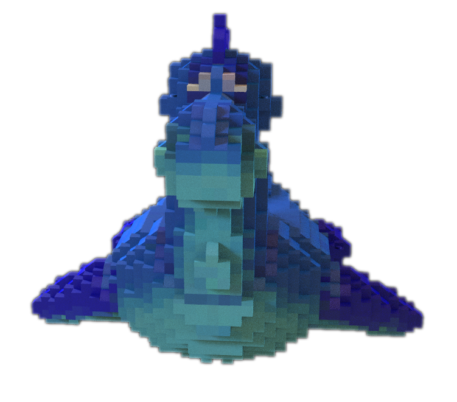
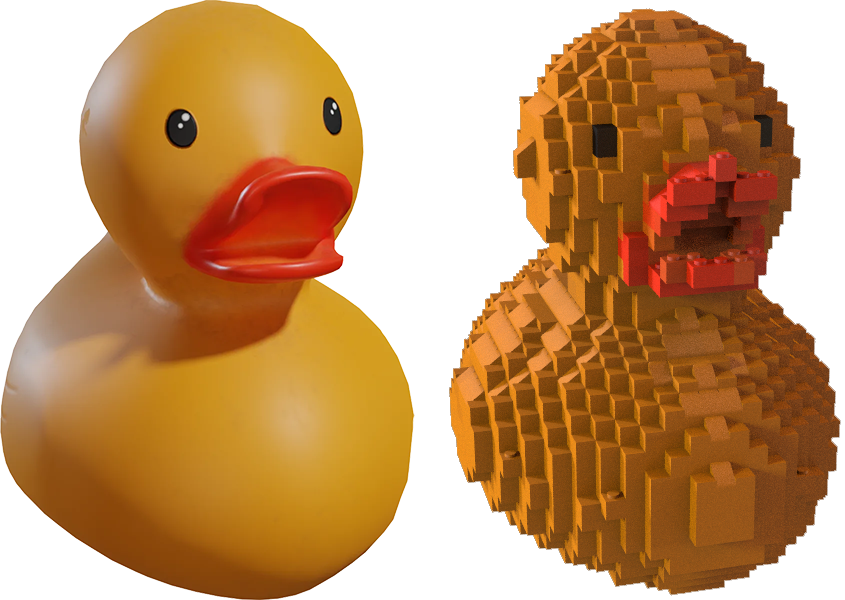
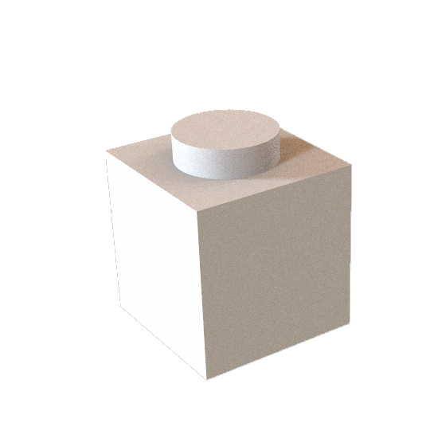
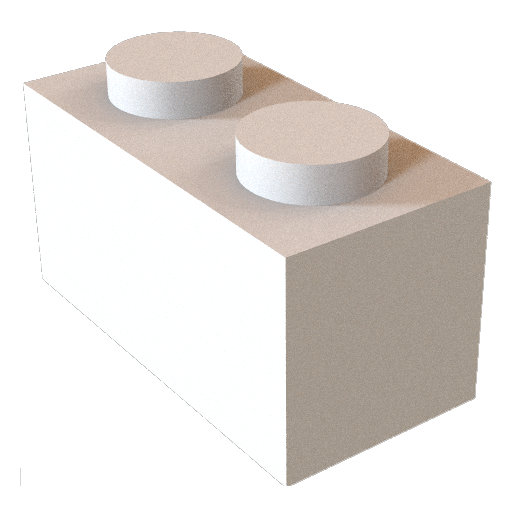
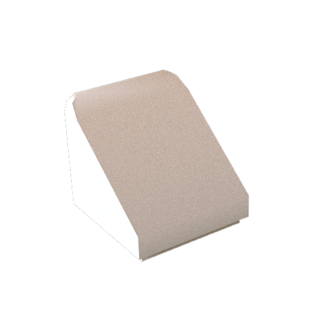
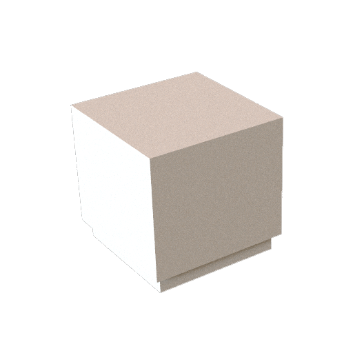
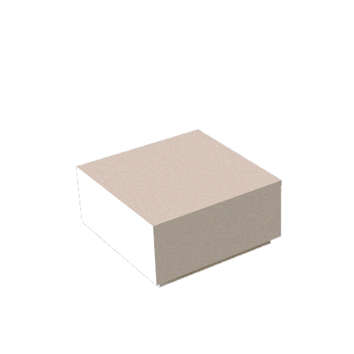
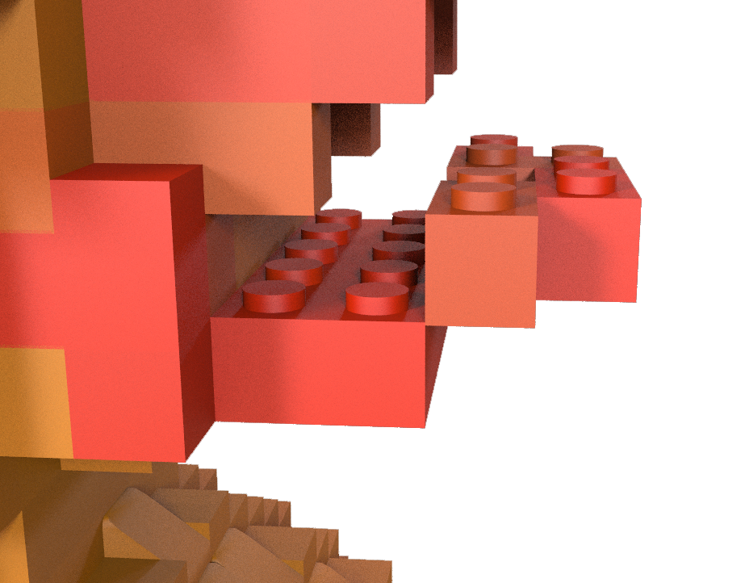

# LEGO-ifying Meshes

## Results

**Extra Credit**: rigid body simulation. 

https://github.com/IwakuraRein/hw03-legos/assets/28486541/c432c0e5-7fb5-4202-8e47-14e854db5954

## Brick Types

|   |   |   |   |   |
|---|---|---|---|---|
|  |  |  |  |  |
| 1x1 | 1x2 | slope | flatten 1 | flatten2  |

## Process

- I use `Attribute Wrangle` to directly normalize the bricks' size based on their bounding boxes. Then I use `Match Size` to place them at the world space origin.
- I use `VDB From Polygons` to convert the mesh to the volume. Then I use `Points From Volume` to generate points that are aligned to the grid and use `Attrib From Map` and `Attrib Transfer` to fetch the color information from the texture.
- I use `Attribute Wrangle` to find the points whose top is empty to place the flat brick and slope brick. Then I check their surroundings. If a point has 4 neighbors, a large flatten brick will be placed. If a point has 3 neighbors, a slope will be placed and oriented towards the empty neighboring position. If a point has 2 or 1 neighbor, a small flatten brick will be placed.
- For the rest of the points, I use `For-each Loop` to check them one by one. If a point has a neighbor, a 1x2 brick will be placed and its neighbor point will be deleted. Otherwise, a 1x1 brick will be placed.
- Instead of `Copy to Points`, I use another `For-each Loop` to copy the brick meshes to the points. I use `Attribute Wrangle` inside the loop to modify the primitives' names (otherwise the same-type bricks will be considered as a single object in the simulation).
- I use `Assemble` to create packed primitives.
- I use `Rigid Body Solver`, `Ground Plane`, and `Gravity Force` in a DOP network to run the simulation.

## Problems

Some bricks aren't attached to the main structure. 
