# LEGO-fying Meshes
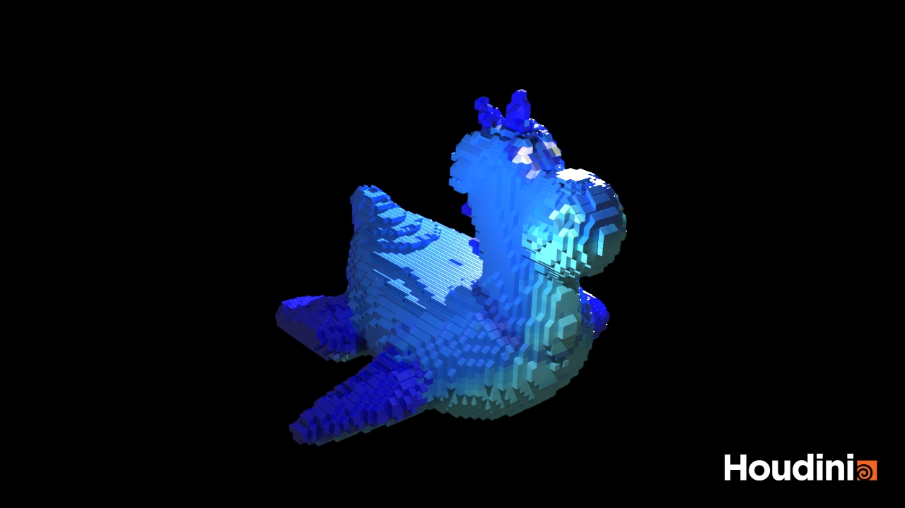

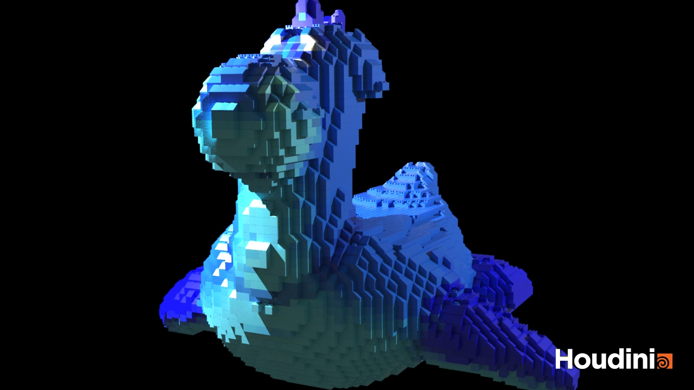

## Project Overview
This is a Houdini project that can convert any faceted mesh to a collection of LEGO pieces. The project uses a variety of LEGO pieces and exposes various parameters to the user so that they can tweak the final LEGO assembly.

## LEGO Brick Types
This project supports the following 3 brick types:
| Block bricks        | Slope bricks         | Flat bricks|
| -----------         | -----------          |------              |
| |  | |

The various kinds of bricks and their placement is decided in the following manner:

| Brick Type        | Placement Logic         |
| -----------         | -----------          |
| 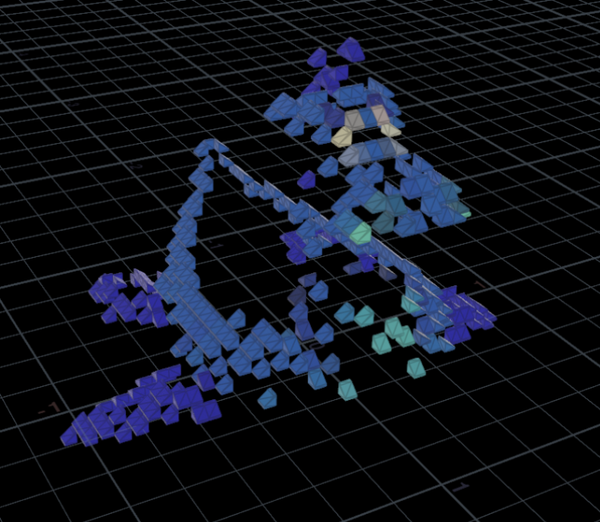| We first isolate all the particles at the top of the mesh's surface. Then, we identify the particles where the surface normal is 'sufficiently different' than a certain user-provided threshold. These blocks are then oriented by applying a normal-aware rotation. |
| 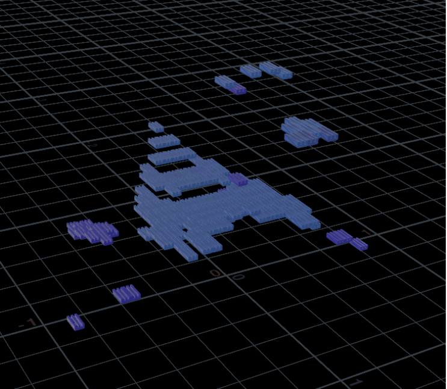 | Next, we look at all the remaining top points, and place 2x1x1 grill blocks wherever possible. All the particles that result in intersecting blocks are discarded. |
| 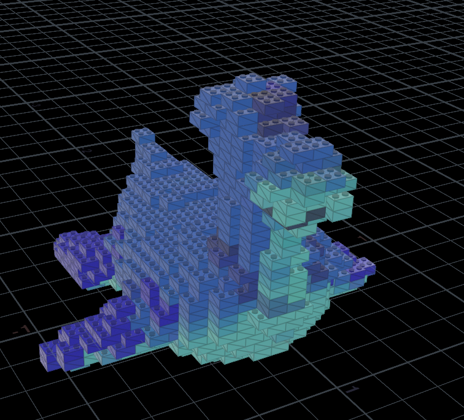 | We then try to place 2x1x2 on all the 'non-top' particles, as well as the particles discarded in the previous step. This also uses the intersection logic similar to the previous step, and rejects all non-conforming particles. |
| 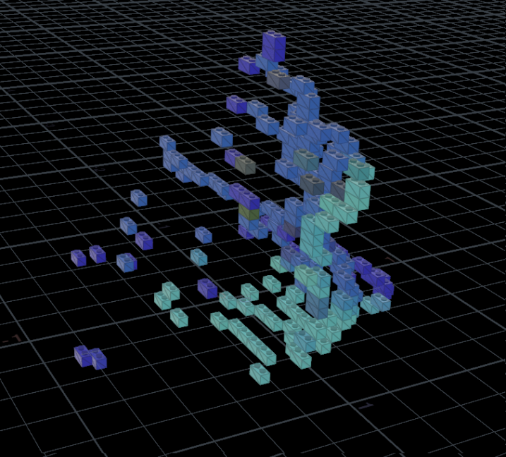 | All the remaining positions are tried to be filled with 2x1x1 blocks with the similar intersection logic as before. |
| 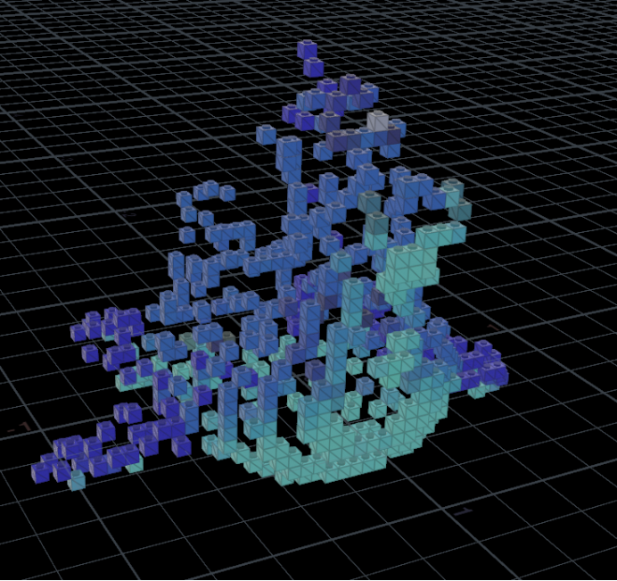 | Finally, all the remaining particles end up with 1x1x1 blocks placed on top of them. |

## User Configurable Parameters
A user is allowed to interact with the LEGOfier as a singular tool using certain parameters:
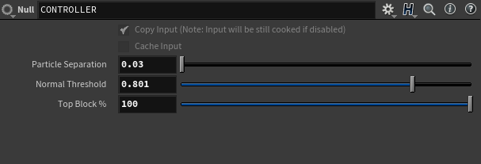
- **Particle Separation** handles the scale of the bricks that compose the model, allowing it to be made from more or fewer bricks.

| Particle Separation = 0.1       | Particle Separation = 0.05         | Particle Separation = 0.03|
| -----------         | -----------          |------              |
| 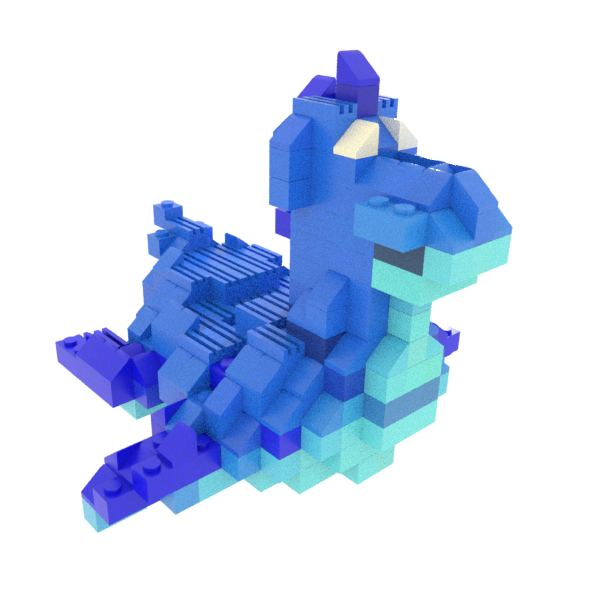|  | 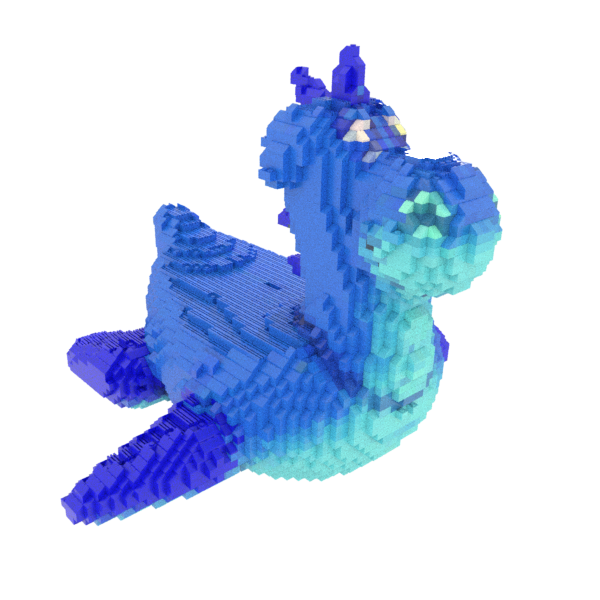|

- **Normal Threshold** can be used for changing the threshold at which a particle is determined to be a sloped brick instead of a block brick.

| Normal Threshold = 0.01       | Normal Threshold = 0.05         | Normal Threshold = 0.08|
| -----------         | -----------          |------              |
| 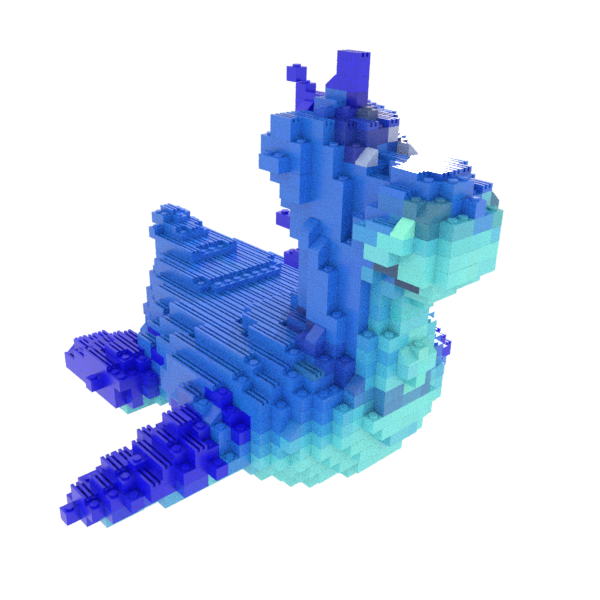|  | |

- **Top Block %** adjusts the percentage of "top" particles that display as flat bricks, rather than placing no brick there at all. 

| Top Block % = 10%       | Top Block % = 50%         | Top Block % = 100%|
| -----------         | -----------          |------              |
| 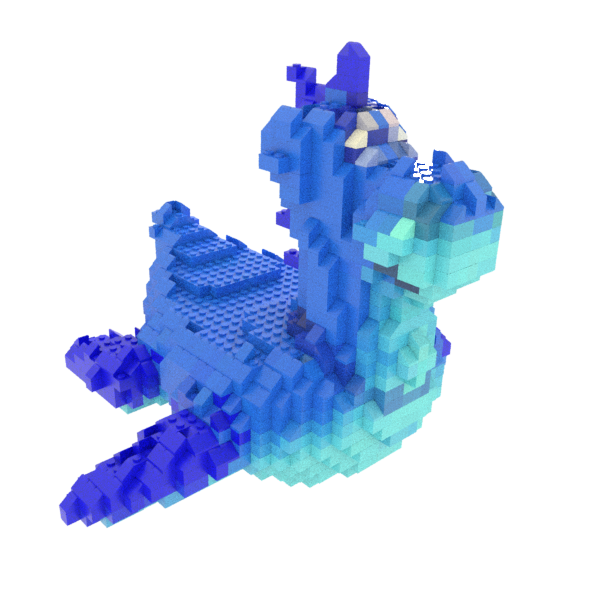|  | |

## Final Renders

1. the Karma Render is used to get the final renders shown at the very beginning of this document.
2. A plastic material is assigned to the mesh to closely match the LEGO look & feel.
3. The 3-point lighting method is used to provide lighting in the scene for the final renders.  

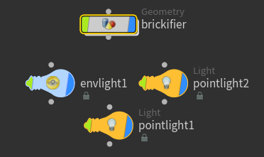 
