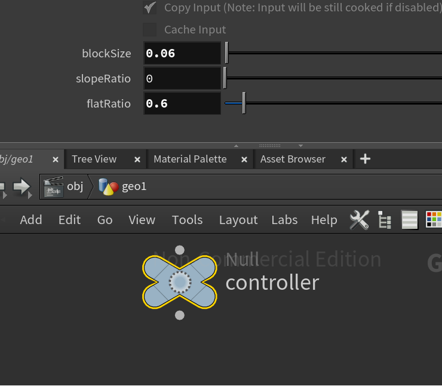

# LEGO-ifying Meshes

## Project Overview

This is a Houdini project that can convert any faceted mesh to a collection of LEGO pieces.

The bricks used: 

2x2, 2x1, 1x1 brick

2x2, 2x1, 1x1 flat brick

1x1 sloped brick

## Parameter Controller

#### Adjusting the scale of the bricks that compose your model, allowing it to be made from more or fewer bricks
| few bricks |  more bricks | many bricks| 
|---|---|---|
| | ||
 

#### Changing the threshold at which a particle is determined to be a sloped brick instead of a block brick
| few sloped bricks |  more sloped bricks| 
|---|---|
| | |
 

#### Adjusting the percentage of "top" particles that display as flat bricks, rather than placing no brick there at all
| less flat bricks |  more flat bricks| 
|---|---|
| | |
 

## Implementation Steps

- Convert the input object from volume to points.
  - Use the AttributeFromMap and AttributeTransfer nodes to transfer color of object using its texture to points.
- Use AttribWrangle node to calculate the points at top.
  - A random number is added here to adjust the percentage of "top" particles that display as flat bricks.
- For each point group ( top points & body points), run iterations to placee the bricks.
  - At first, run a loop to try to place 2x2 bricks.
  - And then run a loop over the remaining points to try to place 2x1 bricks.
  - Assign regular brick for body group and flat brick for top group.
- For remaining points (which should use 1x1 bricks), determine whether to put sloped bricks.
  - Use AttributeTransfer node to transfer normal of object to points.
  - Use group node to split them by normal
  - Use AttribWrangle node to adjust the point normals to be along with x-axis or z-axis.
- Finally, a three-point lighting image is rendered
