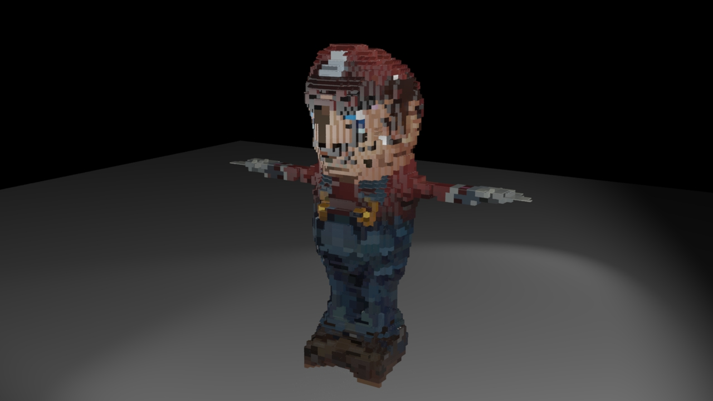
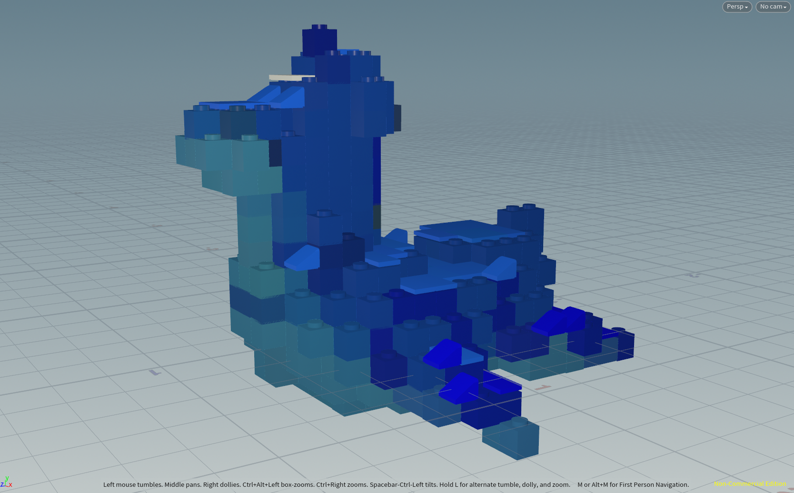

# LEGO-ifying Meshes

## Project Overview
This is a Houdini project that procedurally transform a 3D model to a Lego-style model with different types of bricks. 

## Outcome

## Process
### Voxelize the input 3D model
Firstly, used `group` node, `pointsfromvolume1` node, `vdbfrompolygons1` node, `convertvdb1` node to find the point set that fill the input geomerty. 

### Map Color and Normal onto Points
Subsequently, use `attributeFromMap` and `attributeTransfer` to transform **Normal** and **Color** to the point set.
|Color| Normal|
|:---------:|:---------:|
|||

### Extract Points on the Surface
Then, extract points on the surface (orange points in the graph) by `transform` node, `group` node, and `groupCombine` node. 

After that used `attribWrangle` node and `split` node to keep "edge points", whose normal is neither perpendicular nor parallel to world up, only. These points are called `slope points` and will be used to place `slope bricks`.

### Extract Points on the Top
After that, extract points on the top (orange points in the graph) by `attribWrangle` node and `split` node from the modified point set (subtract with the `slope points`). These points will be used to place `flat bricks`.

### Place Different Bricks
Have `slop points`, `top points`, and `non-top points`, we can place different types of brick without intersection.
- 1. For `slop points` simply place `slope brick` at the position with some transformation.
- 2. For `top` points and `non-top points`, used a loop to iteration the point set and check whether it is valid to place a $2\times 2$ brick or $2\times 1$ brick at each points' location to avoid intersection. Place $1\times 1$ bricks on the invalid position.

|Slop only| Top only| Non-top only|
|:---------:|:---------:|:---------:|
||||

Finally used a `merge` node to combine the result:

### Parameter Control
Finally, I added a controller that allows to adjust the level of division, ratio of "top" particles that display as flat bricks, and the radtio of a particle is determined to be a sloped brick.

 

|Low resolution| High resolution|
|:---------:|:---------:|
|||