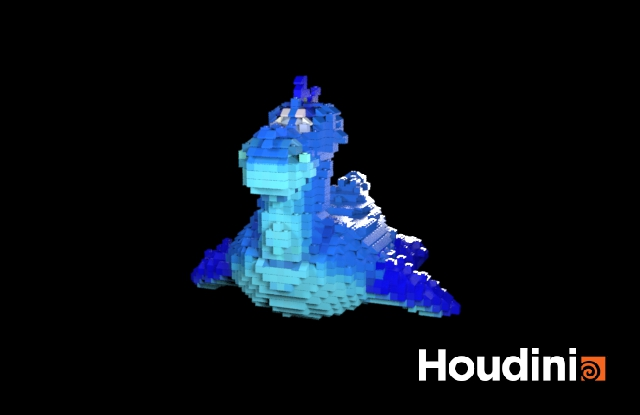

# LEGO-ifying Meshes

## Project Overview

## Process
### Mesh to points
I use `VDB From Polygons` and `Points from Volume` nodes to specify all the points needed in the Lego block generation process. I use a group and blast node to keep only all needed. Also, I used a `attribTransfer` node to transfer the color and normal property from the corresponding texture map.

### Points to Lego Bricks
The three block components make up the final lego dragon
| Block bricks        | Slope bricks         | Flat bricks|
| -----------         | -----------          |------      |
| |  | |

#### Blocks
Before categorizing the points into these three kinds, I first do a scale down to divide the points into interior points and surface points. All the surface points will go through the branch to judge slope and flat blocks. After than, the rest block will go back to act as mormal 1x1 blocks.

In the block determine branch, I will go through all the points to see if it can fit into 2x2 or 1x2 blocks. If not, I will use 1x1 block to copy to points.

#### Slope
I use the dot product between normal and (0, 1, 0) vector to choose slope out of points. The dissimilarity in controller affects the value of dot product. 

#### Flat
I choose those without block on top by searching half radius with a vertical offset. Also, the point is of normal with dot product > 0.9. There is also a flat percentage parameter controlling the whole flat percentage.

### Merge and controller
Finally, I merge all components together to form the complete geometry. There is also a controller for paramters:

Here are examples for the geometry with different voxel size:

| Voxel Size = 0.1       | Voxel Size = 0.05         | Voxel Size = 0.03 |
| -----------         | -----------          |------      |
| |  | |

### Simulation
I use a `DOP network` node and `rigidbodysolver` node to simulate the physic motion of the dropping lego.