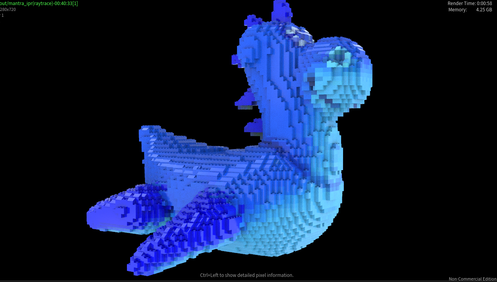
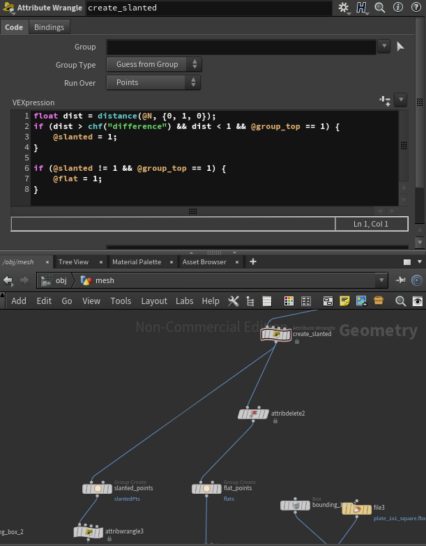

# LEGO-ifying Meshes

## Project Overview
For this project, I implemented a Legoify procedural custom node in Houdini, where the input can be any type of block with a set dimension and a mesh, and the output is that same mesh but modified with procedural lego bricks. 

Here is an image of the final product:

## Extracting the Points
To extract the points from the mesh, the main node that I used was the pointsFromVolume node, which took any mesh that I gave it and turned the mesh into a collection of points that are each separated by a controllable amount. Displayed below is the node structure of the pointsFromVolume node:

I would then group everything into a points group, that would be the main set of groups that I needed to divide.

## Dividing the Groups
There are three main groups that my custom node considers, which are groups for blocks that are placed at the top of the mesh, groups for slanted (or sloped) blocks, and groups for regularly shaped blocks. To extract the group of points at the top of the mesh, I used the pcfind() function, which finds a group of points around a set radius from the center point. In this case, the pcfind() function should only be used to check whether or not there exists a point above the current point, which indicates that our current point is not a top point. Therefore, if pcfind() finds no solution, then that point is indeed a top point, which I then placed in the top group. Below is the Attribute Wrangle code that I used to isolate the top points into two separate groups:

I also had this Attribute Wrangle node placed this high because I would need the values in the top points group for filling in the rest of the bricks in a subsequent loop.

### Slanted and Flat Top Bricks
Whilst dividing the groups, I then needed to figure out how to isolate points that would be used for slanted bricks from the rest of the top group. To this, I needed to check whether there was enough of a dissimilarity of the surface normal of the current point with the vector (0, 1, 0). If the threshold difference was reached, I would place those points into the slanted group, whereas the rest of the points would be replaced with a flat 1x1 block. Below is a snippet of code that I used in another Attribute Wrangle node to isolate the slanted brick points:

## The Bricking Formula
The Greedy Algorithm to Check for Intersections of Bricks, or the Bricking Formula, is a for loop that iterates through all of the non-top points, checks for points lying within a bounding box that is the dimensions of the current block that we want to place in the current point, and if points do lie within the bounding box, we remove them from the points group to be "bricked". Below is a screenshot of the for loop implementation of the greedy algorithm to check for brick intersections:

As observed in the screenshot, I have exposed the statement that shows points that I am placing into the bricks group, which is the group that will have the legos placed over them. After the forloop finishes executing, I get a group of points such that only one point lies in the bounding box. This group will then get passed into a copyToPoints node with the lego object, which then completes the rendering process.

## Progress Screenshots
As I had quite a bit of trouble attempting to wire the nodes together, I took a series of screenshots documenting my progress throughout the creation of this node:

## Final Renders

