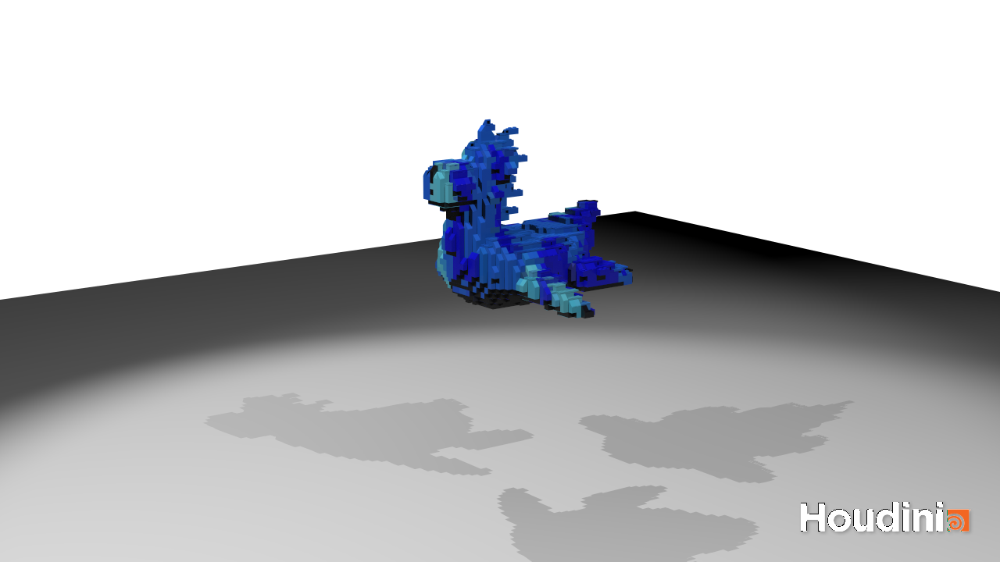

# LEGO-ifying Meshes

## Project Overview
This is a Houdini project that can convert any faceted mesh into a collection of LEGO pieces.  
Currently support:
| Block bricks (2x2; 2x1; 1x1)     | Slope bricks         | Flat bricks        |
| -----------                      | -----------          |------              |
| |  | |

## Result
  

https://github.com/Jeff-Ling/hw03-legos/assets/74678923/6249256a-1329-45a5-aeff-e9c5ed282314

## Steps:
1. Converting a mesh to points  
    

3. Separating points into three groups  
  I first select all the points at the top and save them as group flat. Then I choose the points where the transferred surface normal is sufficiently dissimilar to the vector <0, 1, 0> and put into them to the group slope. Lastly, the remaining points are count as the group block.

4. Placing LEGO bricks to the points.
  3.1 Block Bricks
       First, use a for loop to find out all the points that are able to place a 2x2 brick. Then, do the same thing for 2x1 bricks. The remaining points are replaced by 1x1 bricks.
       

  3.2 Slope Bricks
       Separate points into 4 different groups corresponding to 4 different face directions, by dot multiply the normal of the point and direction vector. Then, place the block correspondingly.
         

  3.3 Flat Bricks
       Use the same trick I used when placing 2x1 bricks.
         

## Extra Credit: Rigid body simulation
