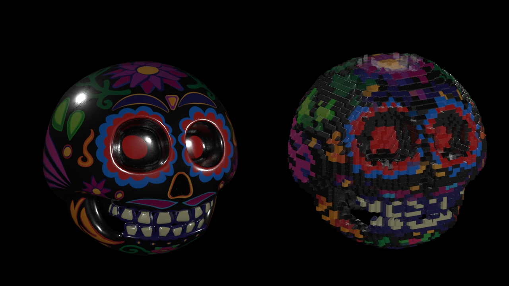

# LEGO-ifyer

## Project Overview
This is a Houdini project that converts any mesh into a lego-ified version of that mesh, filling it up with multiple types of Lego blocks.

In essence, this project solves a slightly more involved voxelisation problem. A node network setup first converts the mesh into a volume, generates uniformly distributed points inside the volume, then fills up the entire volume with appropriate lego blocks.

### Block types

| Block bricks        | Slope bricks         | Cap bricks|
| -----------         | -----------          |------              |
| |  | |

A greedy algorithm fills the volume in this way:

1. First, all particles at the top of the volume are separated out. Particles with a surface normal that is sufficiently dissimilar to the world up vector `(0,1,0)` get `1x1` sloped blocks placed on them. The slope is oriented based on the surface normals as well. The remaining top particles are replaced with `2x1` and then with `1x2` cap bricks.
2. All remaining particles are first filled with `2x2` bricks, the remaining particles after that are filled with `2x1` bricks, the remaining particles after that with `1x2` bricks, and the last set with `1x1` bricks.

### User controllable parameters

1. `Lego Density` - Controls the resolution of lego-voxelisation.

| Density 3        | Density 5        | Density 10|
| -----------         | -----------          |------              |
| |   |  |

2. `Slope Brick Threshold` - Controls the threshold at which top bricks are converted to slope bricks.

| Slope bricks threshold 25         | Slope bricks threshold 75        | Slope bricks threshold 95|
| -----------         | -----------          |------              |
| |  | |
   
3. `Top Cap Percent` - Controls the percentage of non-slope top bricks that are covered by caps.

| Top Cap 0%        | Top Cap 50%         | Top Cap 100% |
| -----------         | -----------          |------              |
| |  | |

---

## Results

||
|---|
||
||

## Credits

Calavera and pumpkin models and textures by Andre Edgarian